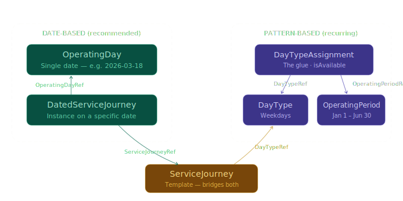
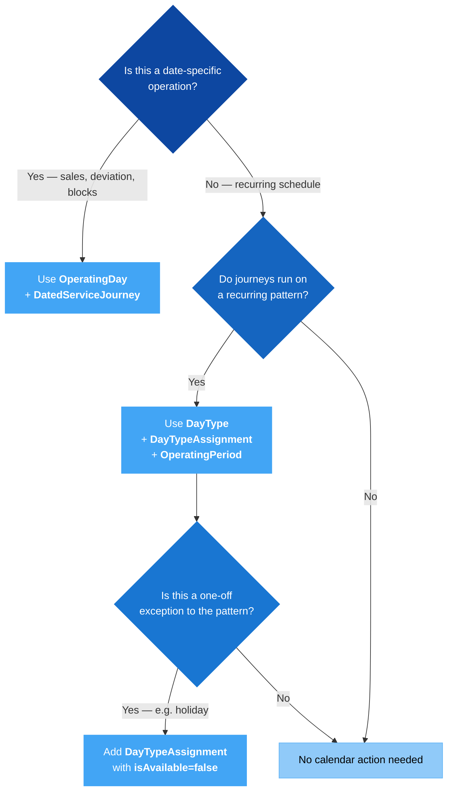

# 📅 Calendar — When Services Operate

*Technical guide*

## 1. 🎯 Introduction

A timetable answers two questions: *what runs?* and *when does it run?* The journey lifecycle guides cover the first question (Line → Route → JourneyPattern → ServiceJourney). This guide covers the second — the calendar model that determines which dates a service operates on, and how to handle exceptions like holidays.

In this guide you will learn:
- 🗓️ The **date-based** model: **OperatingDay** + **DatedServiceJourney** (recommended starting point)
- 🧩 The **pattern-based** model: **DayType**, **OperatingPeriod**, **DayTypeAssignment**
- 🔗 How the two mechanisms relate and work together
- 🚫 How to model **exceptions** (holidays, one-off closures) using `isAvailable=false`
- 📝 Worked XML examples for each scenario

---

## 2. 🧩 The Calendar Objects

All calendar data lives in the **ServiceCalendarFrame**. Two distinct mechanisms exist — date-based and pattern-based:



| Object | What it represents | Defined in | Referenced by |
|--------|--------------------|------------|---------------|
| **OperatingDay** | A single calendar date | ServiceCalendarFrame | DatedServiceJourney via `OperatingDayRef` |
| **DatedServiceJourney** | A journey instance on a specific date | TimetableFrame | — (consumed by downstream systems) |
| **DayType** | A recurring day pattern (e.g., "Weekdays") | ServiceCalendarFrame | ServiceJourney via `DayTypeRef`; DayTypeAssignment via `DayTypeRef` |
| **OperatingPeriod** | A date range (FromDate → ToDate) | ServiceCalendarFrame | DayTypeAssignment via `OperatingPeriodRef` |
| **DayTypeAssignment** | The binding between a DayType and a date range or specific date | ServiceCalendarFrame | — (it's the glue, not typically referenced by others) |

> [!NOTE]
> The date-based model (OperatingDay + DatedServiceJourney) is the recommended starting point. It is explicit, unambiguous, and directly consumable by sales, deviation, and block assignment systems. The pattern-based model adds convenience for recurring schedules but requires additional resolution logic.

---

## 3. 🗓️ Date-Based Scheduling: OperatingDay + DatedServiceJourney

The date-based model is the most direct: an **OperatingDay** represents a single calendar date, and a **DatedServiceJourney** pins a ServiceJourney template to that date.

| Mechanism | Objects involved | Used for |
|-----------|-----------------|----------|
| **Date-based** | OperatingDay → DatedServiceJourney | Specific dates: sales, deviations, cancellations, replacements, reinforcements, block assignments |

### How it works

```xml
<!-- 1. Define the date -->
<OperatingDay id="NP:OperatingDay:2026-03-18" version="1">
  <CalendarDate>2026-03-18</CalendarDate>
</OperatingDay>

<!-- 2. Create a dated instance of a ServiceJourney -->
<DatedServiceJourney id="NP:DatedServiceJourney:100_0730_20260318" version="1">
  <ServiceJourneyRef ref="NP:ServiceJourney:100_0730"/>
  <OperatingDayRef ref="NP:OperatingDay:2026-03-18"/>
</DatedServiceJourney>
```

This is unambiguous: "ServiceJourney 100_0730 operates on 2026-03-18." No resolution logic needed — downstream systems can consume it directly.

### When to use date-based scheduling

- **Ticket sales** — products are sold for specific dates
- **Deviation handling** — cancellations, replacements, and reinforcements target specific dates
- **Block assignment** — vehicles are assigned to journeys on specific dates
- **Real-time operations** — AVL/APC systems track journeys by date

> [!TIP]
> The date-based model maps directly to what passengers and operators experience: "this specific journey on this specific date." Start here, and layer pattern-based scheduling on top only when managing recurring schedules at scale.

See the [Extended Sales & Deviation Handling](../ExtendedSales_and_DeviationHandling/ExtendedSales_and_DeviationHandling_Guide.md) guide for the full deviation model using DatedServiceJourney.

---

## 4. 🔁 Pattern-Based Scheduling: DayType + DayTypeAssignment + OperatingPeriod

For recurring schedules ("every weekday from January to June"), the pattern-based model avoids enumerating every date individually. A **ServiceJourney** says "I run on Weekdays" by referencing a **DayType**. The **DayTypeAssignment** then resolves "Weekdays" to actual calendar dates within an **OperatingPeriod**.

| Mechanism | Objects involved | Used for |
|-----------|-----------------|----------|
| **Pattern-based** | DayType + DayTypeAssignment + OperatingPeriod → ServiceJourney | Recurring schedules: "every weekday from Jan to Jun" |

### How it works

```xml
<!-- 1. Define the pattern -->
<DayType id="NP:DayType:Weekdays" version="1">
  <Name>Weekdays</Name>
  <properties>
    <PropertyOfDay>
      <DaysOfWeek>Monday Tuesday Wednesday Thursday Friday</DaysOfWeek>
    </PropertyOfDay>
  </properties>
</DayType>

<!-- 2. Define the date range -->
<OperatingPeriod id="NP:OperatingPeriod:2026H1" version="1">
  <FromDate>2026-01-01T00:00:00Z</FromDate>
  <ToDate>2026-06-30T00:00:00Z</ToDate>
</OperatingPeriod>

<!-- 3. Bind pattern to date range -->
<DayTypeAssignment id="NP:DayTypeAssignment:WKD_2026H1" version="1" order="1">
  <OperatingPeriodRef ref="NP:OperatingPeriod:2026H1"/>
  <DayTypeRef ref="NP:DayType:Weekdays"/>
  <isAvailable>true</isAvailable>
</DayTypeAssignment>

<!-- 4. ServiceJourney references the DayType -->
<ServiceJourney id="NP:ServiceJourney:100_0730" version="1">
  <dayTypes>
    <DayTypeRef ref="NP:DayType:Weekdays"/>
  </dayTypes>
  <!-- ... passingTimes ... -->
</ServiceJourney>
```

> [!WARNING]
> A DayType without a DayTypeAssignment is inert. The ServiceJourney references it, but no calendar dates are resolved — the journey will never operate. This is the most common calendar mistake.

---

## 5. 🚫 Handling Exceptions: The `isAvailable` Pattern

Real-world schedules have exceptions: public holidays, one-off closures, seasonal changes. NeTEx handles these by stacking DayTypeAssignments with `isAvailable=false`.

### Example: Weekdays Except Christmas Day

```xml
<!-- Base assignment: weekdays in 2026 -->
<DayTypeAssignment id="NP:DayTypeAssignment:WKD_2026" version="1" order="1">
  <OperatingPeriodRef ref="NP:OperatingPeriod:2026"/>
  <DayTypeRef ref="NP:DayType:Weekdays"/>
  <isAvailable>true</isAvailable>
</DayTypeAssignment>

<!-- Exception: Christmas Day falls on a Friday in 2026 — exclude it -->
<DayTypeAssignment id="NP:DayTypeAssignment:WKD_Christmas" version="1" order="2">
  <Date>2026-12-25</Date>
  <DayTypeRef ref="NP:DayType:Weekdays"/>
  <isAvailable>false</isAvailable>
</DayTypeAssignment>
```

**How evaluation works:**

1. Assignments are evaluated in `@order` sequence.
2. `order="1"` includes all weekdays in 2026.
3. `order="2"` then excludes December 25 — even though it's a Friday.
4. The result: all weekdays in 2026 except Christmas Day.

> [!WARNING]
> **Order matters.** A `false` assignment must have a higher `@order` than the `true` assignment it overrides. If order is wrong, the exclusion may be overridden by a later inclusion.

### Example: Adding a Special Saturday Service

You can also use `isAvailable=true` to add specific dates that wouldn't normally match the pattern:

```xml
<!-- Saturdays during football season -->
<DayTypeAssignment id="NP:DayTypeAssignment:SAT_Football" version="1" order="1">
  <Date>2026-04-11</Date>
  <DayTypeRef ref="NP:DayType:Saturdays"/>
  <isAvailable>true</isAvailable>
</DayTypeAssignment>
```

---

## 6. 🗓️ When to Use Which



| Scenario | Mechanism | Objects |
|----------|-----------|---------|
| "Bus 100 cancelled on March 18" | Date-based | OperatingDay + DatedServiceJourney with `ServiceAlteration=cancellation` |
| "Extra bus for football match on April 11" | Date-based | OperatingDay + DatedServiceJourney with `ServiceAlteration=extraJourney` |
| "Sell tickets for train 3702 on May 25" | Date-based | OperatingDay + DatedServiceJourney |
| "Bus 100 runs every weekday" | Pattern-based | DayType + DayTypeAssignment + OperatingPeriod |
| "No service on Christmas Day" | Pattern-based exception | DayTypeAssignment with `isAvailable=false` |
| "Different summer timetable Jun–Aug" | Pattern-based | Separate DayType + OperatingPeriod for summer |

---

## 7. ❌ Common Mistakes

| Mistake | Why It Fails | Fix |
|---------|-------------|-----|
| Confusing DayType with OperatingDay | Different mechanisms for different purposes | OperatingDay = specific date for DatedServiceJourney; DayType = recurring pattern for ServiceJourney |
| Using DayType for a one-off deviation | DayType is for recurring patterns, not single-date exceptions | Use OperatingDay + DatedServiceJourney for date-specific changes |
| DayType without DayTypeAssignment | No calendar dates resolved — journey never operates | Always create a DayTypeAssignment binding the DayType to an OperatingPeriod |
| Wrong `@order` on overlapping DayTypeAssignments | Exception may not override the base rule | Ensure `false` assignments have a higher `@order` than the `true` ones they override |
| OperatingPeriod without FromDate or ToDate | Invalid date range | Both FromDate and ToDate are required |
| Holiday exception without `isAvailable=false` | The date is still included in the pattern | Set `isAvailable` to `false` on the exception DayTypeAssignment |
| Multiple DayTypeAssignments with same `@order` | Evaluation order is ambiguous | Use unique, sequential `@order` values |

---

## 8. ✅ Best Practices

1. **Start with date-based scheduling.** OperatingDay + DatedServiceJourney is explicit, unambiguous, and directly consumable. Use it for sales, deviations, and block assignment.

2. **Use pattern-based scheduling for recurring timetables.** When the same schedule applies across many dates, DayType + DayTypeAssignment + OperatingPeriod avoids redundant enumeration.

3. **Always pair DayType with DayTypeAssignment.** A DayType without an assignment is dead weight. Validate that every DayType referenced by a ServiceJourney has at least one DayTypeAssignment.

4. **Name DayTypes descriptively.** Use clear labels like "Weekdays", "Saturdays", "School holidays" — not opaque codes.

5. **Use `@order` deliberately.** Start at 1 for the base inclusion, then increment for each exception. Document the order logic in comments within the XML if the assignment stack is complex.

6. **Keep OperatingPeriods aligned with timetable periods.** Typically, an OperatingPeriod covers one timetable period (e.g., "2026 Spring", "2026 Summer"). Avoid overlapping OperatingPeriods for the same DayType unless necessary.

7. **Group calendar data in ServiceCalendarFrame.** All DayTypes, OperatingPeriods, DayTypeAssignments, and OperatingDays belong in the ServiceCalendarFrame — not scattered across other frames.

8. **Handle year boundaries with separate OperatingPeriods.** When a timetable spans a year boundary (e.g., winter 2026–2027), use distinct OperatingPeriods for each calendar year to avoid confusion with holiday exceptions that differ year to year.

---

## 9. 📄 Example: Full Calendar Setup

A complete example showing OperatingDays for date-specific instances, Weekdays and Saturdays patterns, an OperatingPeriod, and DayTypeAssignments with a Christmas exception:

> 📄 **Full example:** [Example_Calendar.xml](Example_Calendar.xml) — A ServiceCalendarFrame with date-based OperatingDays, pattern-based schedules, and holiday exceptions.

---

## 10. 🔗 Related Resources

### Guides
- [How to Build a Timetable](../HowToBuildATimetable/HowToBuildATimetable_Guide.md) — The full chain from Line to DatedServiceJourney
- [Extended Sales & Deviation Handling](../ExtendedSales_and_DeviationHandling/ExtendedSales_and_DeviationHandling_Guide.md) — How DatedServiceJourney handles cancellations, replacements, and reinforcements
- [Get Started](../GetStarted/GetStarted_Guide.md) — NeTEx fundamentals and document anatomy

### Frames & Objects
- [ServiceCalendarFrame](../../Frames/ServiceCalendarFrame/Table_ServiceCalendarFrame.md) — The frame containing all calendar data
- [OperatingDay](../../Objects/OperatingDay/Table_OperatingDay.md) — Single calendar date
- [DatedServiceJourney](../../Objects/DatedServiceJourney/Table_DatedServiceJourney.md) — The dated instance that references OperatingDay
- [DayType](../../Objects/DayType/Table_DayType.md) — Recurring day pattern specification
- [ServiceJourney](../../Objects/ServiceJourney/Table_ServiceJourney.md) — The template that references DayType

### External
- [NeTEx CEN Standard](https://www.netex-cen.eu/) — Official specification
