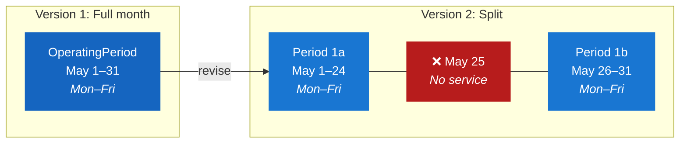
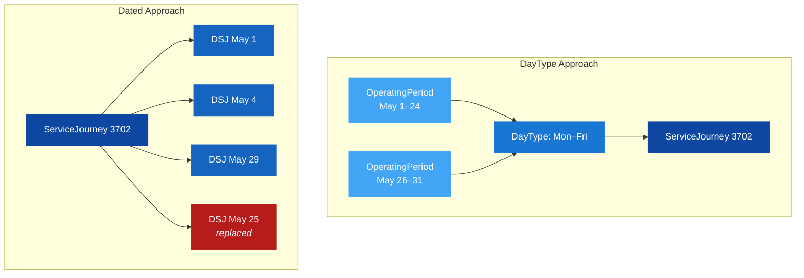

# 🚧 Deviation Evolution (DayType variant) — A Real-World Example

*Technical Guide*

## 1. 🎯 Introduction

This guide presents the **same Flytoget deviation scenario** as the [Deviation Evolution (Dated)](DeviationEvolution_Guide.md) guide, but uses the **DayType / DayTypeAssignment** calendar pattern instead of explicit DatedServiceJourney + OperatingDay.

Both approaches are valid in the Nordic Profile. The DayType approach is typical for long-term plans where journeys repeat on predictable patterns (e.g. "every weekday"). When a deviation occurs, the calendar is modified rather than individual journey instances.

**The scenario (same as before):** Flytoget train 3702 (Oslo Lufthavn → Drammen, departing 05:30) is disrupted on 25 May 2026 due to track work between Skøyen and Asker.

**Key difference from the Dated variant:**
- Cancellation is expressed by **splitting the OperatingPeriod** to exclude the disrupted date
- Replacement services get their own **DayType** valid only on the disrupted date
- No `ServiceAlteration` or `replacedJourneys` — the calendar itself determines which days each journey runs

> [!TIP]
> Compare this side by side with the [Dated variant](DeviationEvolution_Guide.md) to understand the trade-offs between the two approaches.

---

## 2. 📐 File Structure

This variant uses two files, just like the Dated variant:

| File | Contents |
|------|----------|
| [Example_Common.xml](Example_Common.xml) | Shared data: stops, operators, DayTypes, OperatingPeriods, DayTypeAssignments |
| [Example_FLY1.xml](Example_FLY1.xml) | Line file: routes, patterns, journeys (referencing DayTypes) |

The **calendar logic lives in the common file**, while the line file focuses purely on service structure and times.

---

## 3. 📋 Step 1 — The Long-Term Plan

The original plan uses a single DayType for Monday–Friday and an OperatingPeriod covering all of May:

```xml
<!-- _common.xml — ServiceCalendarFrame version 1 -->
<ServiceCalendar id="FLT:ServiceCalendar:1" version="1">
    <FromDate>2026-05-01+01:00</FromDate>
    <ToDate>2026-05-31+01:00</ToDate>
    <dayTypes>
        <DayType version="1" id="FLT:DayType:0">
            <properties>
                <PropertyOfDay>
                    <DaysOfWeek>Monday Tuesday Wednesday Thursday Friday</DaysOfWeek>
                </PropertyOfDay>
            </properties>
        </DayType>
    </dayTypes>
</ServiceCalendar>

<operatingPeriods>
    <OperatingPeriod id="FLT:OperatingPeriod:1" version="1">
        <FromDate>2026-05-01T00:00:00</FromDate>
        <ToDate>2026-05-31T23:59:59</ToDate>
    </OperatingPeriod>
</operatingPeriods>

<dayTypeAssignments>
    <DayTypeAssignment version="1" order="1" id="FLT:DayTypeAssignment:0">
        <OperatingPeriodRef ref="FLT:OperatingPeriod:1"/>
        <DayTypeRef version="1" ref="FLT:DayType:0"/>
    </DayTypeAssignment>
</dayTypeAssignments>
```

The ServiceJourney in the line file references this DayType:

```xml
<!-- hafas_FLY1.xml — ServiceJourney with DayTypeRef -->
<ServiceJourney id="FLT:ServiceJourney:1-2614-3702-20260519" version="1">
    <PrivateCode>3702</PrivateCode>
    <TransportMode>rail</TransportMode>
    <dayTypes>
        <DayTypeRef ref="FLT:DayType:0"/>
    </dayTypes>
    <JourneyPatternRef ref="FLT:JourneyPattern:1-7" version="1"/>
    <passingTimes>
        <!-- 05:30 Oslo Lufthavn → 06:28 Drammen -->
    </passingTimes>
</ServiceJourney>
```

Result: train 3702 runs every weekday in May — including 25 May.

> [!NOTE]
> With DayTypes, a single ServiceJourney covers all dates matching the pattern. There's no need for individual DatedServiceJourney objects per date.

---

## 4. ❌ Step 2 — Cancellation via Calendar Split

To cancel 25 May, the operator doesn't mark a journey as cancelled. Instead, the **OperatingPeriod is split** into two ranges that skip 25 May:

```xml
<!-- _common.xml — ServiceCalendarFrame version 2 -->
<operatingPeriods>
    <OperatingPeriod id="FLT:OperatingPeriod:1a" version="1">
        <FromDate>2026-05-01T00:00:00</FromDate>
        <ToDate>2026-05-24T23:59:59</ToDate>
    </OperatingPeriod>
    <OperatingPeriod id="FLT:OperatingPeriod:1b" version="1">
        <FromDate>2026-05-26T00:00:00</FromDate>
        <ToDate>2026-05-31T23:59:59</ToDate>
    </OperatingPeriod>
</operatingPeriods>

<dayTypeAssignments>
    <DayTypeAssignment version="2" order="1" id="FLT:DayTypeAssignment:0a">
        <OperatingPeriodRef ref="FLT:OperatingPeriod:1a"/>
        <DayTypeRef version="2" ref="FLT:DayType:0"/>
    </DayTypeAssignment>
    <DayTypeAssignment version="2" order="2" id="FLT:DayTypeAssignment:0b">
        <OperatingPeriodRef ref="FLT:OperatingPeriod:1b"/>
        <DayTypeRef version="2" ref="FLT:DayType:0"/>
    </DayTypeAssignment>
</dayTypeAssignments>
```



Key points:
- **No change to the line file** — the ServiceJourney still references `DayType:0`, but that DayType now resolves to May 1–24 + May 26–31
- The cancellation is *implicit* — 25 May is simply not covered by any OperatingPeriod
- The line file in Step 2 contains a comment noting this: the calendar in `_common.xml` handles the exclusion

> [!IMPORTANT]
> This approach makes the cancellation less explicit than `ServiceAlteration=cancellation`. A consumer must compare calendar versions to detect that a date was removed. This is a trade-off of the DayType pattern.

---

## 5. 🔀 Step 3 — Replacement Trains with New DayTypes

The replacement services need their own DayTypes, valid only on 25 May:

```xml
<!-- _common.xml — ServiceCalendarFrame version 3 -->
<dayTypes>
    <DayType version="1" id="FLT:DayType:A">
        <properties>
            <PropertyOfDay>
                <DaysOfWeek>Monday</DaysOfWeek>
            </PropertyOfDay>
        </properties>
    </DayType>
    <DayType version="1" id="FLT:DayType:B">
        <properties>
            <PropertyOfDay>
                <DaysOfWeek>Monday</DaysOfWeek>
            </PropertyOfDay>
        </properties>
    </DayType>
</dayTypes>

<operatingPeriods>
    <OperatingPeriod id="FLT:OperatingPeriod:2026-05-25" version="1">
        <FromDate>2026-05-25T00:00:00</FromDate>
        <ToDate>2026-05-25T23:59:59</ToDate>
    </OperatingPeriod>
</operatingPeriods>

<dayTypeAssignments>
    <DayTypeAssignment version="1" order="1" id="FLT:DayTypeAssignment:A">
        <OperatingPeriodRef ref="FLT:OperatingPeriod:2026-05-25"/>
        <DayTypeRef version="1" ref="FLT:DayType:A"/>
    </DayTypeAssignment>
    <DayTypeAssignment version="1" order="2" id="FLT:DayTypeAssignment:B">
        <OperatingPeriodRef ref="FLT:OperatingPeriod:2026-05-25"/>
        <DayTypeRef version="1" ref="FLT:DayType:B"/>
    </DayTypeAssignment>
</dayTypeAssignments>
```

The replacement ServiceJourneys reference these DayTypes:

```xml
<!-- hafas_FLY1.xml — Replacement trains -->
<ServiceJourney id="FLT:ServiceJourney:3702A" version="1">
    <PrivateCode>3702A</PrivateCode>
    <TransportMode>rail</TransportMode>
    <dayTypes>
        <DayTypeRef ref="FLT:DayType:A"/>
    </dayTypes>
    <JourneyPatternRef ref="FLT:JourneyPattern:1-7-A" version="1"/>
    <passingTimes>
        <!-- 05:30 Oslo Lufthavn → 06:00 Skøyen -->
    </passingTimes>
</ServiceJourney>

<ServiceJourney id="FLT:ServiceJourney:3702B" version="1">
    <PrivateCode>3702B</PrivateCode>
    <TransportMode>rail</TransportMode>
    <dayTypes>
        <DayTypeRef ref="FLT:DayType:B"/>
    </dayTypes>
    <JourneyPatternRef ref="FLT:JourneyPattern:1-7-B" version="1"/>
    <passingTimes>
        <!-- 06:15 Asker → 06:28 Drammen -->
    </passingTimes>
</ServiceJourney>
```

> [!NOTE]
> The DayTypes use `DaysOfWeek: Monday` because 25 May 2026 is a Monday. Combined with the single-day OperatingPeriod, this ensures they only run on that specific date.

---

## 6. 🚌 Step 4 — Rail Replacement Bus

A third DayType (`FLT:DayType:C`) is added for the bus, and train 3702B's departure is updated to 06:35 to connect with the bus arriving Asker at 06:30:

```xml
<!-- _common.xml — ServiceCalendarFrame version 4 -->
<DayType version="1" id="FLT:DayType:C">
    <properties>
        <PropertyOfDay>
            <DaysOfWeek>Monday</DaysOfWeek>
        </PropertyOfDay>
    </properties>
</DayType>

<DayTypeAssignment version="1" order="1" id="FLT:DayTypeAssignment:C">
    <OperatingPeriodRef ref="FLT:OperatingPeriod:2026-05-25"/>
    <DayTypeRef version="1" ref="FLT:DayType:C"/>
</DayTypeAssignment>
```

```xml
<!-- hafas_FLY1.xml — Bus service -->
<ServiceJourney id="FLT:ServiceJourney:3702C" version="1">
    <PrivateCode>3702C</PrivateCode>
    <TransportMode>bus</TransportMode>
    <TransportSubmode>
        <BusSubmode>railReplacementBus</BusSubmode>
    </TransportSubmode>
    <dayTypes>
        <DayTypeRef ref="FLT:DayType:C"/>
    </dayTypes>
    <JourneyPatternRef ref="FLT:JourneyPattern:1-7-C" version="1"/>
    <passingTimes>
        <!-- 06:05 Skøyen → 06:12 Lysaker → 06:20 Sandvika → 06:30 Asker -->
    </passingTimes>
</ServiceJourney>

<!-- Revised train B: departure moved to 06:35 -->
<ServiceJourney id="FLT:ServiceJourney:3702B" version="2">
    <PrivateCode>3702B</PrivateCode>
    <TransportMode>rail</TransportMode>
    <dayTypes>
        <DayTypeRef ref="FLT:DayType:B"/>
    </dayTypes>
    <JourneyPatternRef ref="FLT:JourneyPattern:1-7-B" version="1"/>
    <passingTimes>
        <!-- 06:35 Asker → 06:48 Drammen -->
    </passingTimes>
</ServiceJourney>
```

---

## 7. 🔄 Comparing the Two Approaches

| Aspect | DayType (this guide) | DatedServiceJourney ([other guide](DeviationEvolution_Guide.md)) |
|--------|---------------------|----------------------------------------------|
| Calendar model | DayType + OperatingPeriod + DayTypeAssignment | OperatingDay + DatedServiceJourney |
| Cancellation | Split OperatingPeriod to exclude date | `ServiceAlteration=cancellation` on DatedServiceJourney |
| Replacement link | None (implicit via same date) | Explicit `replacedJourneys` back-reference |
| Consumer clarity | Must diff calendar versions | Status field is self-describing |
| Verbosity (21 weekdays) | 1 ServiceJourney + 1 DayType | 1 ServiceJourney + 21 DatedServiceJourneys |
| Best for | Stable long-term plans | Operational / real-time deviation messaging |



> [!TIP]
> The Nordic Profile recommends the **DatedServiceJourney approach** for deviation handling because it provides explicit status (`ServiceAlteration`) and explicit replacement links (`replacedJourneys`). The DayType approach works well for stable base plans but loses semantic clarity when deviations occur.

---

## 8. 🧭 Where to Go Next

- [Deviation Evolution (Dated)](DeviationEvolution_Guide.md) — the same scenario using DatedServiceJourney
- [Calendar Guide](../Calendar/Calendar_Guide.md) — DayType, OperatingPeriod, and DayTypeAssignment in detail
- [Journey Lifecycle](../JourneyLifecycle/JourneyLifecycle_Guide.md) — planned → dated → cancelled → replaced → extra
- [How to Build a Timetable](../HowToBuildATimetable/HowToBuildATimetable_Guide.md) — foundational timetable objects
