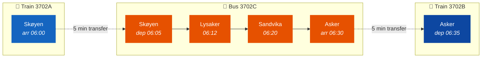
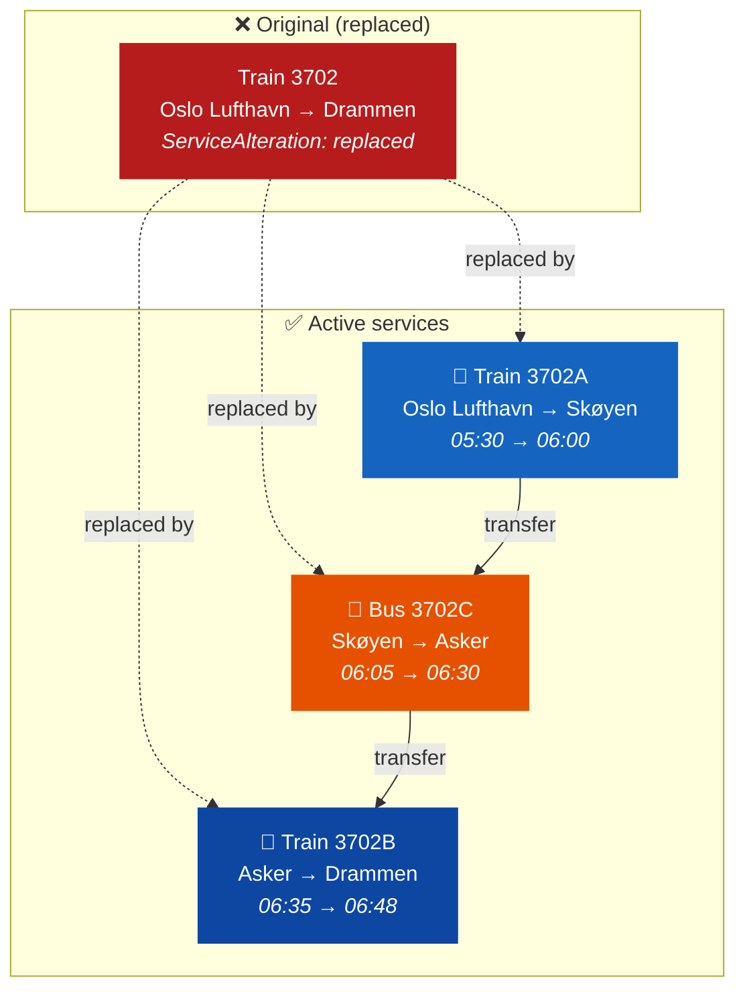

# 🚧 Deviation Evolution — A Real-World Example

*Technical Guide*

## 1. 🎯 Introduction

In the real world, timetables rarely survive contact with reality unchanged. Tracks need maintenance, vehicles break down, and weather disrupts services. When a planned journey can't operate as intended, the operator must communicate what happens instead — and NeTEx provides precise mechanisms for this.

This guide walks through a **real Flytoget deviation scenario** step by step, showing how a single journey evolves from a long-term plan through cancellation to a multi-part replacement with rail replacement bus. Each step is a separate CompositeFrame revision, demonstrating how NeTEx versioning keeps the full history while delivering progressively more detail.

**The scenario:** Flytoget train 3702 (Oslo Lufthavn → Drammen, departing 05:30) is disrupted on 25 May 2026 due to track work between Skøyen and Asker.

**In this guide you will learn:**
- How a planned journey is expressed as a DatedServiceJourney
- How to cancel a journey using ServiceAlteration
- How to replace it with shorter train segments
- How to add a rail replacement bus to bridge the gap
- How versioning ties the evolution together

> [!TIP]
> If you're not familiar with the basic timetable objects (ServiceJourney, DatedServiceJourney, JourneyPattern), read the [How to Build a Timetable](../HowToBuildATimetable/HowToBuildATimetable_Guide.md) guide first. For the full lifecycle model, see [Journey Lifecycle](../JourneyLifecycle/JourneyLifecycle_Guide.md).

---

## 2. 🗺️ The Route — Oslo Lufthavn to Drammen

Train 3702 runs the full Flytoget FLY1 route southbound:

```mermaid
flowchart LR
    S1["Oslo Lufthavn<br/><i>dep 05:30</i>"]
    S2["Lillestrøm<br/><i>05:42</i>"]
    S3["Oslo S<br/><i>05:52</i>"]
    S4["Nationaltheatret<br/><i>05:56</i>"]
    S5["Skøyen<br/><i>06:00</i>"]
    S6["Lysaker<br/><i>06:04</i>"]
    S7["Sandvika<br/><i>06:09</i>"]
    S8["Asker<br/><i>06:15</i>"]
    S9["Drammen<br/><i>arr 06:28</i>"]

    S1 --> S2 --> S3 --> S4 --> S5 --> S6 --> S7 --> S8 --> S9

    style S1 fill:#0D47A1,stroke:#0D47A1,color:#fff
    style S2 fill:#1565C0,stroke:#1565C0,color:#fff
    style S3 fill:#1565C0,stroke:#1565C0,color:#fff
    style S4 fill:#1565C0,stroke:#1565C0,color:#fff
    style S5 fill:#1976D2,stroke:#1976D2,color:#fff
    style S6 fill:#1E88E5,stroke:#1E88E5,color:#fff
    style S7 fill:#1E88E5,stroke:#1E88E5,color:#fff
    style S8 fill:#1976D2,stroke:#1976D2,color:#fff
    style S9 fill:#0D47A1,stroke:#0D47A1,color:#fff
```



The disrupted section (Skøyen–Asker) is highlighted in lighter blue. On 25 May, no trains can run through this segment.

---

## 3. 📋 Step 1 — The Long-Term Plan

The first delivery is the **normal timetable**: a ServiceJourney template with times, and one DatedServiceJourney per weekday in May.

```xml
<!-- CompositeFrame version="1" — the long-term plan -->
<ServiceJourney id="FLT:ServiceJourney:3702" version="1">
    <PrivateCode>3702</PrivateCode>
    <TransportMode>rail</TransportMode>
    <TransportSubmode>
        <RailSubmode>airportLinkRail</RailSubmode>
    </TransportSubmode>
    <JourneyPatternRef ref="FLT:JourneyPattern:1-7" version="1"/>
    <passingTimes>
        <TimetabledPassingTime>
            <DepartureTime>05:30:00</DepartureTime>  <!-- Oslo Lufthavn -->
        </TimetabledPassingTime>
        <!-- ... intermediate stops ... -->
        <TimetabledPassingTime>
            <ArrivalTime>06:28:00</ArrivalTime>  <!-- Drammen -->
        </TimetabledPassingTime>
    </passingTimes>
</ServiceJourney>

<!-- One DatedServiceJourney per weekday -->
<DatedServiceJourney id="FLT:DatedServiceJourney:3702-2026-05-25" version="1">
    <ServiceJourneyRef ref="FLT:ServiceJourney:3702" version="1"/>
    <OperatingDayRef ref="FLT:OperatingDay:2026-05-25"/>
</DatedServiceJourney>
```

At this point, the journey is **planned as normal**. The consumer sees: "Train 3702 runs Oslo Lufthavn → Drammen at 05:30 on 25 May."

> [!NOTE]
> The CompositeFrame has `modification="new"` and `version="1"`. This is the baseline — all subsequent steps increment the version and use `modification="revise"`.

---

## 4. ❌ Step 2 — Cancellation

The operator learns that track work will prevent service on 25 May. The first action is to **cancel** the journey:

```xml
<!-- CompositeFrame version="2" — cancellation -->
<TimetableFrame id="FLT:TimetableFrame:1" version="2">
    <vehicleJourneys>
        <DatedServiceJourney id="FLT:DatedServiceJourney:3702-2026-05-25" version="2">
            <ServiceAlteration>cancellation</ServiceAlteration>
            <ServiceJourneyRef ref="FLT:ServiceJourney:3702" version="1"/>
            <OperatingDayRef ref="FLT:OperatingDay:2026-05-25"/>
        </DatedServiceJourney>
    </vehicleJourneys>
</TimetableFrame>
```

Key points:
- **Same DatedServiceJourney ID**, but `version="2"` — this supersedes version 1
- **ServiceAlteration** set to `cancellation` — tells consumers this journey will not run
- The ServiceJourney template (version 1) is unchanged — only the *dated instance* is affected
- The CompositeFrame validity narrows to just 25 May

> [!IMPORTANT]
> A cancellation does not delete the journey. It explicitly marks it as cancelled so that downstream systems can inform passengers ("Train 3702 is cancelled on 25 May"). Silence (simply removing the DatedServiceJourney) would be ambiguous — did it never exist, or was it withdrawn?

---

## 5. 🔀 Step 3 — Replacement Trains

The operator now plans replacement services. Since the disruption is between Skøyen and Asker, they split the original journey into two shorter trains:

- **3702A**: Oslo Lufthavn → Skøyen (the segment *before* the disruption)
- **3702B**: Asker → Drammen (the segment *after* the disruption)

```mermaid
flowchart LR
    subgraph Train3702A["🚆 Train 3702A"]
        A1["Oslo Lufthavn<br/><i>dep 05:30</i>"]
        A2["Lillestrøm<br/><i>05:42</i>"]
        A3["Oslo S<br/><i>05:52</i>"]
        A4["Nationaltheatret<br/><i>05:56</i>"]
        A5["Skøyen<br/><i>arr 06:00</i>"]
    end
    subgraph Gap["🚫 Disrupted"]
        G1["Lysaker"]
        G2["Sandvika"]
    end
    subgraph Train3702B["🚆 Train 3702B"]
        B1["Asker<br/><i>dep 06:15</i>"]
        B2["Drammen<br/><i>arr 06:28</i>"]
    end

    A1 --> A2 --> A3 --> A4 --> A5
    A5 -.- G1 -.- G2 -.- B1
    B1 --> B2

    style A1 fill:#1565C0,stroke:#1565C0,color:#fff
    style A2 fill:#1565C0,stroke:#1565C0,color:#fff
    style A3 fill:#1565C0,stroke:#1565C0,color:#fff
    style A4 fill:#1565C0,stroke:#1565C0,color:#fff
    style A5 fill:#1565C0,stroke:#1565C0,color:#fff
    style G1 fill:#B71C1C,stroke:#B71C1C,color:#fff
    style G2 fill:#B71C1C,stroke:#B71C1C,color:#fff
    style B1 fill:#0D47A1,stroke:#0D47A1,color:#fff
    style B2 fill:#0D47A1,stroke:#0D47A1,color:#fff
```



The XML shows:

```xml
<!-- CompositeFrame version="3" — replacement trains -->

<!-- The original journey status changes from "cancellation" to "replaced" -->
<DatedServiceJourney id="FLT:DatedServiceJourney:3702-2026-05-25" version="3">
    <ServiceAlteration>replaced</ServiceAlteration>
    <ServiceJourneyRef ref="FLT:ServiceJourney:3702" version="1"/>
    <OperatingDayRef ref="FLT:OperatingDay:2026-05-25"/>
</DatedServiceJourney>

<!-- Replacement train A: Oslo Lufthavn → Skøyen -->
<DatedServiceJourney id="FLT:DatedServiceJourney:3702A-2026-05-25" version="1">
    <ServiceJourneyRef ref="FLT:ServiceJourney:3702A" version="1"/>
    <OperatingDayRef ref="FLT:OperatingDay:2026-05-25"/>
    <replacedJourneys>
        <DatedVehicleJourneyRef ref="FLT:DatedServiceJourney:3702-2026-05-25"/>
    </replacedJourneys>
</DatedServiceJourney>

<!-- Replacement train B: Asker → Drammen -->
<DatedServiceJourney id="FLT:DatedServiceJourney:3702B-2026-05-25" version="1">
    <ServiceJourneyRef ref="FLT:ServiceJourney:3702B" version="1"/>
    <OperatingDayRef ref="FLT:OperatingDay:2026-05-25"/>
    <replacedJourneys>
        <DatedVehicleJourneyRef ref="FLT:DatedServiceJourney:3702-2026-05-25"/>
    </replacedJourneys>
</DatedServiceJourney>
```

Key points:
- **ServiceAlteration changes** from `cancellation` to `replaced` — semantically, the journey is still not running, but now replacements exist
- **replacedJourneys** on each replacement DatedServiceJourney links back to the original — consumers can show "This journey replaces train 3702"
- Each replacement has its own **ServiceJourney**, **JourneyPattern**, and **Route** — they are independent journeys with their own times and stop sequences
- The replacement trains maintain the same times for their shared stops (05:30 departure from Oslo Lufthavn, 06:28 arrival at Drammen)

> [!NOTE]
> At this stage, passengers travelling Skøyen → Asker have no service. The gap is acknowledged but not yet filled.

---

## 6. 🚌 Step 4 — Rail Replacement Bus

The final piece: a bus bridges the gap between Skøyen and Asker, stopping at Lysaker and Sandvika along the way.



```xml
<!-- CompositeFrame version="4" — rail replacement bus -->

<ServiceJourney id="FLT:ServiceJourney:3702C" version="1">
    <PrivateCode>3702C</PrivateCode>
    <TransportMode>bus</TransportMode>
    <TransportSubmode>
        <BusSubmode>railReplacementBus</BusSubmode>
    </TransportSubmode>
    <JourneyPatternRef ref="FLT:JourneyPattern:1-7-C" version="1"/>
    <passingTimes>
        <TimetabledPassingTime>
            <DepartureTime>06:05:00</DepartureTime>  <!-- Skøyen -->
        </TimetabledPassingTime>
        <TimetabledPassingTime>
            <ArrivalTime>06:12:00</ArrivalTime>
            <DepartureTime>06:12:00</DepartureTime>  <!-- Lysaker -->
        </TimetabledPassingTime>
        <TimetabledPassingTime>
            <ArrivalTime>06:20:00</ArrivalTime>
            <DepartureTime>06:20:00</DepartureTime>  <!-- Sandvika -->
        </TimetabledPassingTime>
        <TimetabledPassingTime>
            <ArrivalTime>06:30:00</ArrivalTime>  <!-- Asker -->
        </TimetabledPassingTime>
    </passingTimes>
</ServiceJourney>

<DatedServiceJourney id="FLT:DatedServiceJourney:3702C-2026-05-25" version="1">
    <ServiceJourneyRef ref="FLT:ServiceJourney:3702C" version="1"/>
    <OperatingDayRef ref="FLT:OperatingDay:2026-05-25"/>
    <replacedJourneys>
        <DatedVehicleJourneyRef ref="FLT:DatedServiceJourney:3702-2026-05-25"/>
    </replacedJourneys>
</DatedServiceJourney>
```

Key points:
- **TransportMode** is `bus` with **BusSubmode** `railReplacementBus` — this tells apps to show a bus icon and indicate it's a substitute for rail
- The bus departs Skøyen at 06:05, giving passengers a **5-minute transfer** from train 3702A (arriving 06:00)
- Similarly, the bus arrives Asker at 06:30, and train 3702B departs at **06:35** — another 5-minute transfer window
- The bus also uses **replacedJourneys** to link back to the original cancelled train
- In version 4, train 3702B's departure is updated to 06:35 (from 06:15 in version 3) to align with the bus connection

---

## 7. 📊 The Complete Picture

Here's how the four versions fit together for 25 May 2026:

| Version | Modification | What changes |
|---------|-------------|--------------|
| 1 | `new` | Normal plan: train 3702 runs Oslo Lufthavn → Drammen |
| 2 | `revise` | Cancellation: 3702 on 25 May marked `cancellation` |
| 3 | `revise` | Replacement: status → `replaced`, trains 3702A + 3702B added |
| 4 | `revise` | Bus for tog: bus 3702C fills the gap, 3702B times adjusted |

The **final state** for a consumer on 25 May:



---

## 8. 🔑 Key Patterns

### Versioning via CompositeFrame

Each step is delivered as a new **version** of the same CompositeFrame (`FLT:CompositeFrame:2`). The `modification="revise"` attribute tells consumers to replace the previous version. This allows:
- Incremental delivery (each step can be published as soon as the decision is made)
- Full traceability (consumers can reconstruct the decision history)
- Partial override (only the affected date's validity window changes)

### ServiceAlteration values

| Value | Meaning |
|-------|---------|
| `planned` | Normal service (default, usually omitted) |
| `cancellation` | Journey will not run, no replacement available yet |
| `replaced` | Journey will not run, but replacements exist |
| `extra` | Unplanned additional service |

### The replacedJourneys link

The `replacedJourneys` element in a replacement DatedServiceJourney creates an explicit back-reference:

```xml
<replacedJourneys>
    <DatedVehicleJourneyRef ref="FLT:DatedServiceJourney:3702-2026-05-25"/>
</replacedJourneys>
```

This enables passenger apps to show: *"This service replaces cancelled train 3702."*

### Transport mode on replacement bus

```xml
<TransportMode>bus</TransportMode>
<TransportSubmode>
    <BusSubmode>railReplacementBus</BusSubmode>
</TransportSubmode>
```

The `railReplacementBus` submode is distinct from regular bus service — it signals to journey planners and passenger apps that this is a temporary substitute, not a permanent route.

---

## 9. 📂 File Structure

This example uses the standard Nordic Profile file split:

| File | Contents |
|------|----------|
| [Example_CommonDated.xml](Example_CommonDated.xml) | Shared data: stops, operators, calendar, stop assignments |
| [Example_FLY1_Dated.xml](Example_FLY1_Dated.xml) | Line file: routes, patterns, journeys, all 4 deviation steps |

> [!NOTE]
> In production, each step would typically be a separate delivery. Here they are combined in one file for illustration purposes.

---

## 10. 🧭 Where to Go Next

- [Journey Lifecycle](../JourneyLifecycle/JourneyLifecycle_Guide.md) — the full lifecycle model: planned → dated → cancelled → replaced → extra
- [How to Build a Timetable](../HowToBuildATimetable/HowToBuildATimetable_Guide.md) — the foundational objects used in this guide
- [Calendar](../Calendar/Calendar_Guide.md) — OperatingDay and alternative calendar patterns
- [Network Timetable](../NetworkTimetable/NetworkTimetable_Guide.md) — how shared and line files relate
