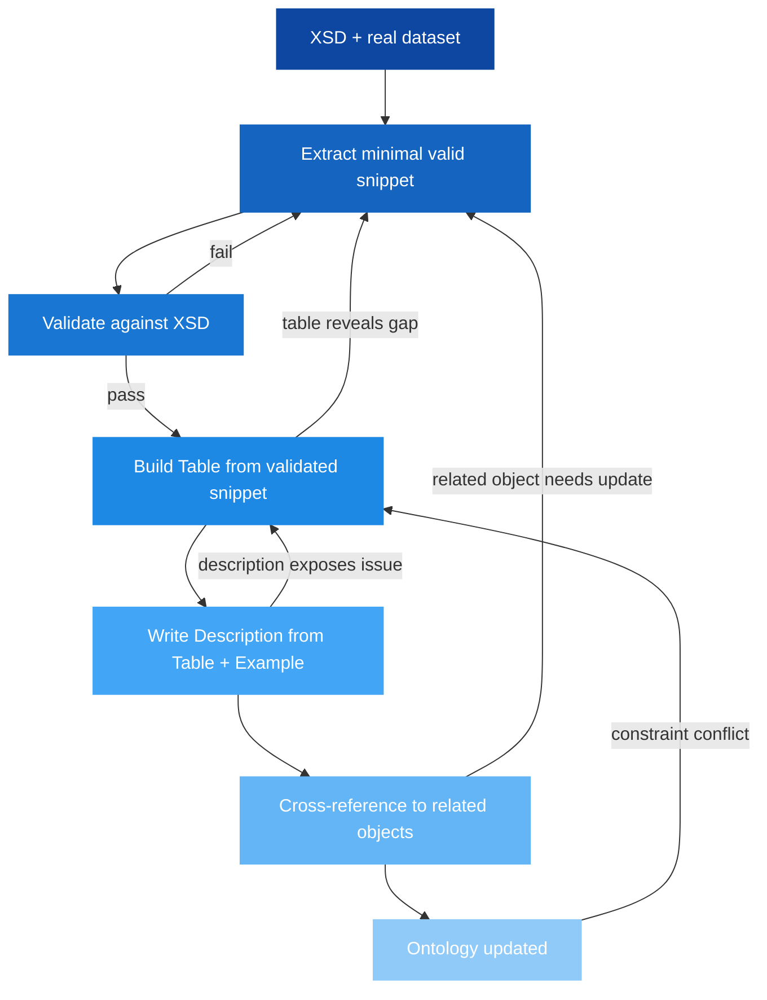

# 🏗️ How This Documentation Was Built

*A guide to the method, workflow, and design principles behind this repository.*

## 1. 🎯 Introduction

This repository documents the Nordic NeTEx Profile — from individual XML elements to complete timetable deliveries. Building it required a method that could handle a complex, interconnected standard without creating inconsistencies or drift between the specification, the examples, and the explanations.

The approach: **start from the schema, generate validated examples, derive structure from those examples, and only then write human-readable descriptions.** An AI agent (GitHub Copilot / Claude) was used as a co-author throughout, guided by strict templates and validation gates.

Critically, this was never a "fire and forget" process — neither from the human nor the AI side. Every artefact went through multiple iterations: drafts were reviewed, corrections fed back, templates evolved based on what worked, and earlier documentation was revisited and improved as understanding deepened.

**In this guide you will learn:**
- 🧱 The three-layer documentation model (Example → Table → Description)
- 🔄 The bottom-up workflow used to produce each object
- 🤖 How LLM agents are constrained to produce consistent output
- 🧪 The validation chain that keeps everything in sync
- 📐 Design principles that shaped the repository

---

## 2. 🧱 The Three-Layer Model

Every NeTEx concept in this repository is documented in three files that serve distinct purposes:

```
Objects/<Name>/
  ├── Example_<Name>_NP.xml      ← Layer 1: Validated XML (source of truth)
  ├── Table_<Name>.md            ← Layer 2: Structural specification (derived from example)
  └── Description_<Name>.md     ← Layer 3: Human explanation (derived from both)
```

| Layer | File | Purpose | Audience |
|-------|------|---------|----------|
| 1 | Example XML | Proves what's valid, defines element order | Machines + developers |
| 2 | Table | Every element, type, cardinality, profile rules | Implementers |
| 3 | Description | What it is, why it exists, how it connects | Everyone |

The layers build **bottom-up**: the example is authoritative, the table is derived from it, and the description is written last using both as input.

> [!NOTE]
> This ordering is deliberate. Writing descriptions first would invite speculation. Starting from validated XML means every statement in the documentation has a concrete, testable backing.

---

## 3. 🔄 The Production Workflow

### 3.1 Starting point: XSD + real data

The project began with two inputs:
- The **official NeTEx XSD** (full schema, ~900 files, CEN standard)
- A **large real-world dataset** (production NeTEx deliveries from Norwegian operators)

The XSD defines what's *possible*. The real data shows what's *actually used* in the Nordic context.

### 3.2 Step-by-step per object — an iterative cycle

The diagram below shows the ideal flow, but in practice every step could send you back to a previous one. A Table review might reveal that the example was too simplistic. Writing the Description might expose a missing reference that requires extending the snippet. The ontology update might surface an inconsistency with a related object that needs revisiting.



**Step 1 — Extract snippet.** From the real dataset, isolate a minimal but representative XML fragment for the object. Strip away noise, but keep enough context to show real references. This often took multiple passes — the first attempt might be too complex, or miss an important edge case that only became apparent later.

**Step 2 — Validate.** Run `python scripts/validate.py` against the full NeTEx XSD. If it fails, fix the snippet — not the table. The XSD is never wrong; our understanding might be. Validation failures were common and instructive: wrong element order, missing mandatory children, incorrect nesting. Each failure deepened understanding of the schema.

**Step 3 — Build Table.** The validated snippet now defines the element order. The Table lists every element, its XSD type, cardinality in the profile (MIN and NP), and whether it's a reference to another object. Tables were frequently revised when later objects revealed that earlier ones had missed elements or used incorrect cardinality.

**Step 4 — Write Description.** With both the example and the table in hand, write the Description following the mandatory 6-section template. The Description explains *why* — purpose, key elements, references, usage notes. This step often triggered rework: writing a clear explanation might expose that the example doesn't demonstrate an important aspect, sending us back to step 1.

**Step 5 — Cross-reference.** Link to related objects (upstream references, downstream consumers) using relative markdown links. Adding these links sometimes revealed gaps — "this object references X, but X isn't documented yet" — triggering a new cycle for the missing object.

**Step 6 — Ontology.** The ontology files (`ontology/*.ttl`) are updated to reflect the object's class, frame membership, relationships, and profile constraints.

> [!NOTE]
> No object was ever "done" in one pass. The typical object went through 2–4 revision cycles as understanding matured, related objects were documented, and edge cases surfaced from real data.

### 3.3 Guides: top-down from concepts, refined iteratively

Guides follow the opposite direction — they start with a concept ("how do I build a timetable?") and work down to the objects:

1. Identify the learning goal
2. Define a progression (simple → complex)
3. Show objects one at a time with growing context
4. End with a complete picture and links to deep-dive documentation
5. Validate all XML snippets in the guide against XSD

But guides also evolved iteratively. Early guides were revised as conventions solidified — diagrams were redone when the SVG style guide was established, sections were restructured when better patterns emerged, and XML snippets were replaced when the object documentation revealed more idiomatic approaches.

---

## 4. 🤖 The Role of the LLM Agent

An AI agent was used as a co-author for most of this documentation. But "co-author" doesn't mean "free to improvise." The agent operates under strict constraints defined in `LLM/README.md`:

### What the agent is given

| Input | Purpose |
|-------|---------|
| `LLM/README.md` | The "constitution" — all rules, section orders, naming conventions |
| `LLM/Templates/` | Exact templates for Object, Frame, and Guide documentation |
| `ontology/*.ttl` | Machine-readable profile model and documentation index — the primary navigation tool |
| `XSD/xsd/` | Full NeTEx schema for validation |
| Existing documentation | Pattern to follow (consistency by example) |

### The real guardrail: validation, not rules

There's no long list of prohibitions. The primary constraint is practical: **if it doesn't validate, it doesn't ship.** An agent can't invent elements that don't exist in the XSD — not because of a rule saying "don't," but because `validate.py` will reject the output immediately. The XSD is the enforcer.

Beyond that, the templates and existing documentation provide strong patterns. The agent learns by example: "here's how the last 20 objects were documented — do it the same way." Consistency emerges from pattern-following, not from policing.

### The feedback loop — continuous, not one-shot

This was never a one-shot generation pipeline. Every piece of documentation went through multiple rounds:

```
Human intent → Agent draft → XSD validation → Human review → Correction → Agent revision → ...
                    ↑                                                              |
                    └────────────────── Repeat until right ─────────────────────────┘
```

Typical iteration patterns:

- **Agent proposes, human corrects direction** — the agent might produce valid XML but model the wrong scenario. The human redirects.
- **Validation rejects, both investigate** — an XSD failure requires understanding *why*. Often this revealed misunderstandings about element ordering or mandatory children that informed future work.
- **Human spots inconsistency across objects** — "the ServiceJourney description says X, but the DatedServiceJourney example implies Y." Both go back and reconcile.
- **Templates evolve** — early documentation didn't follow the templates perfectly. As conventions crystallised, earlier work was revisited and brought into line.
- **Later objects retroactively improve earlier ones** — documenting JourneyPattern revealed gaps in the ScheduledStopPoint documentation. Nothing stayed static.

The agent generates fast; the human decides what's correct. Validation catches structural errors automatically. But neither side "throws it over the wall" — both stay engaged until the result is right.

> [!TIP]
> The key insight: an LLM is excellent at producing *consistent structure at scale* (35+ objects, 9 frames, 20 guides) when given strict templates. It's poor at deciding *what should exist* — that requires domain knowledge from a human. The iterative loop is where these strengths complement each other.

---

## 5. 🧪 The Validation Chain

Multiple layers of validation keep the documentation honest:

| Layer | Tool | What it checks |
|-------|------|----------------|
| XML well-formedness | `lxml` parser | Syntax, encoding, nesting |
| XSD conformance | `scripts/validate.py` | Elements, types, order, cardinality vs NeTEx schema |
| Profile rules | `scripts/validate_profile.py` | Nordic-specific constraints beyond XSD |
| Ontology integrity | `scripts/validate_ontology.py` | TTL files are internally consistent |
| SHACL shapes | `scripts/validate_shacl.py` | Profile constraints expressed as RDF shapes |
| Link integrity | Manual / CI | All relative markdown links resolve to existing files |

The critical rule: **if the XML doesn't validate, nothing else proceeds.** Tables and descriptions are never written against invalid examples.

---

## 6. 📐 Design Principles

### Define once, reference everywhere

Data is never duplicated. A ScheduledStopPoint is defined in one place and referenced by ID from JourneyPatterns, PassengerStopAssignments, and TimetabledPassingTimes. The documentation mirrors this: object documentation lives in one folder and is linked from everywhere.

### Shared + Line file split

The Nordic Profile mandates a delivery structure: shared data (stops, calendars, organisations) in one file, line-specific data (routes, journeys, patterns) in another. Examples in this repo follow the same split, so implementers see exactly what they need to produce.

### Progressive disclosure

- README → high-level entry points
- Guide → conceptual walk-through
- Description → semantic explanation per object
- Table → full structural detail
- Example XML → copy-paste starting point

Each level adds depth without requiring you to read everything.

### Examples are authoritative

When the table disagrees with the example, the example wins (assuming it validates). When the description says something the table doesn't support, the description is wrong. The validated XML is the ground truth.

### Machine and human read the same source

The ontology and the markdown documentation describe the same model. This means an LLM agent can fact-check its own output against the TTL, and a human can read the markdown without needing to understand RDF.

---

## 7. 📁 Repository Architecture

```
NeTEx-Nordic/
├── README.md                  ← Entry point, reading order, quick links
├── Objects/                   ← 35+ objects, each with Description + Table + Example
├── Frames/                    ← 9 frame types (CompositeFrame, ServiceFrame, etc.)
├── Guides/                    ← 20+ topic guides (conceptual, cross-cutting)
├── ontology/                  ← TTL ontology (profile model, documentation index, SHACL shapes)
├── scripts/                   ← Validation tooling (XSD, profile, SHACL, ontology)
├── XSD/                       ← Git submodule → official NeTEx-CEN/NeTEx schema
├── LLM/                       ← Agent rules and templates
│   ├── README.md              ← "The constitution" for agents
│   ├── Templates/             ← Structural templates for all file types
│   └── AgentGuides/           ← Operational instructions (validation, etc.)
└── assets/images/             ← SVG diagrams, illustrations
```

### Key conventions

- **Folder per concept:** `Objects/Line/`, `Guides/Calendar/`, `Frames/ServiceFrame/`
- **Predictable file names:** `Description_X.md`, `Table_X.md`, `Example_X_NP.xml`
- **Relative links everywhere:** no absolute URLs to internal docs
- **Git submodule for XSD:** always pinned to a known-good NeTEx schema version

---

## 8. 🔗 Related Resources

### Internal
- [LLM/README.md](../../LLM/README.md) — Full agent rules and documentation conventions
- [LLM/Templates/](../../LLM/Templates/Object_Struture_and_Table_Template.md) — Templates for new objects
- [Tools Guide](../Tools/Tools_Guide.md) — Development tools and validation setup
- [NeTEx Conventions](../NeTExConventions/NeTEx_Conventions.md) — ID patterns, versioning, naming

### External
- [NeTEx-CEN/NeTEx](https://github.com/NeTEx-CEN/NeTEx) — Official XSD schema
- [CEN TC 278](https://www.netex-cen.eu/) — Standard specification
