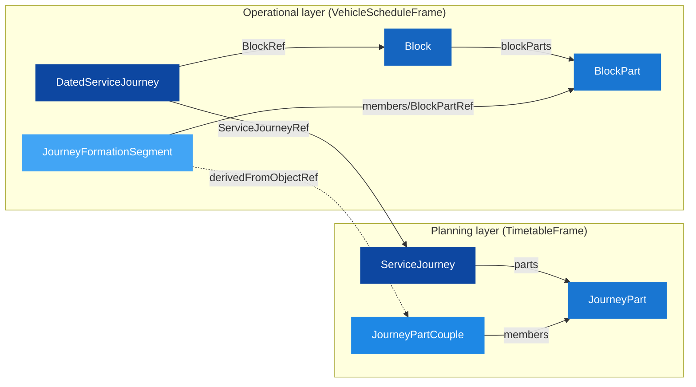

# 🚂 Coupled Journeys — Modelling Train Coupling and Decoupling

## 1. 🎯 Introduction

Night trains in the Nordics frequently couple and decouple en route: two train sets depart different cities, join at an intermediate station, and continue as one physical consist to the final destination. The reverse happens on return journeys. Modelling this in NeTEx requires a clear separation between *commercial intent* (what the passenger buys) and *operational reality* (what physically runs).

This guide uses the **Narvik–Stockholm overnight service** as a worked example: three ServiceJourneys that couple and decouple at Boden C.

In this guide you will learn:
- 🔗 How JourneyPart and JourneyPartCouple express coupling *intent* at the planning level
- 🚃 How Block, BlockPart, and Formation model the *operational* coupling
- 🔄 The two-version delivery pattern (commercial first, vehicle assignment later)
- 🧭 How to trace from a passenger ticket through to physical formation
- 📝 Complete XML examples for a real Nordic coupling scenario

> [!WARNING]
> This guide demonstrates a **candidate modelling approach** for coupled journeys. Several objects used here (`Formation`, `VehicleTypeInFormation`, `JourneyPartCouple`, `JourneyFormationSegment`, `BlockPartInSegment`) are not yet documented in the published Nordic Profile. They represent a mode-agnostic alternative to the documented [CompoundTrain](../../Objects/CompoundTrain/Table_CompoundTrain.md) / [TrainBlock](../../Objects/TrainBlock/Table_TrainBlock.md) pattern. Where objects diverge from or extend the published profile, this is flagged explicitly.

---

## 2. 🧩 Core concept — two independent layers

Train coupling involves two fundamentally different concerns:

| Layer | Question it answers | Owner | Stability |
|-------|--------------------| ------|-----------|
| **Planning** | "Which journeys *should* run coupled?" | Timetable team | Stable — changes only with timetable |
| **Operational** | "Which physical units *actually* ran coupled?" | Vehicle scheduling | Volatile — changes with fleet availability |

NeTEx models these as two **independent object graphs** that can be delivered separately, linked only by a traceability reference (`derivedFromObjectRef`). This follows the Strong Separation of Concerns pattern — the commercial product (ServiceJourney) never changes shape when vehicle assignment is added.



> [!TIP]
> The cross-layer link (`derivedFromObjectRef`) is optional. You can always navigate from planning to operations via `DatedServiceJourney → BlockRef → Block → BlockPart`. The explicit link just makes it faster to answer: "was this coupling operationally fulfilled?"

---

## 3. 🗺️ The scenario — Narvik–Stockholm overnight

Three journeys share infrastructure between Stockholm and Narvik:

| Journey | Route | Coupling behaviour |
|---------|-------|-------------------|
| **SJ:94** | Stockholm C → Narvik | Main overnight (sleeper cars) |
| **SJ:3965** | Stockholm C → Luleå | Seated coaches — decouples at Boden C |
| **SJ:3964** | Luleå → Narvik | Couples onto SJ:94 at Boden C (day+1) |

```text
Stockholm C ─────────────────── Boden C ──────────── Narvik
    │                              │                    │
    ├── SJ:94  (sleepers) ────────►├── continues ──────►│
    │                              │                    │
    ├── SJ:3965 (seated) ─────────►│ (decouples → Luleå)
    │                              │                    │
    │                              ├── SJ:3964 couples ─►│
```

The passenger buying a ticket Stockholm → Narvik sees only **SJ:94**. Operationally, the train changes formation at Boden C — that's what the model captures.

---

## 4. 🔗 Planning layer — JourneyPart and JourneyPartCouple

### Splitting a ServiceJourney into parts

When a journey's formation changes at an intermediate point, split it into **JourneyParts** — one per formation-constant segment:

```xml
<ServiceJourney id="SJN:ServiceJourney:94" version="1">
  <Name>Tog 94 Stockholm–Narvik</Name>
  <JourneyPatternRef ref="SJN:JourneyPattern:94_StockholmC_Narvik"/>
  <passingTimes>
    <!-- Full timetable: Stockholm 18:00 → Boden 06:30/07:00 → Narvik 10:15 -->
  </passingTimes>
  <parts>
    <JourneyPart id="SJN:JourneyPart:94_SthlmBoden" version="1" order="1">
      <Name>Stockholm C → Boden C (coupled with 3965)</Name>
      <FromStopPointRef ref="SJN:SSP:StockholmC"/>
      <ToStopPointRef ref="SJN:SSP:BodenC"/>
    </JourneyPart>
    <JourneyPart id="SJN:JourneyPart:94_BodenNarvik" version="1" order="2">
      <Name>Boden C → Narvik (coupled with 3964)</Name>
      <FromStopPointRef ref="SJN:SSP:BodenC"/>
      <ToStopPointRef ref="SJN:SSP:Narvik"/>
    </JourneyPart>
  </parts>
</ServiceJourney>
```

> [!NOTE]
> JourneyPart does **not** affect the passenger's ticket or passing times. The ServiceJourney remains one bookable product — parts only declare where formation changes occur.

### Declaring coupling intent

A **JourneyPartCouple** groups JourneyParts from *different* ServiceJourneys that run physically coupled over the same segment:

```xml
<!-- Planning-level coupling declaration (TimetableFrame) -->
<JourneyPartCouple id="SJN:JourneyPartCouple:SthlmBoden" version="1">
  <Name>Coupling Stockholm–Boden (Train 94 + 3965)</Name>
  <Description>Sleeper + seated coaches run coupled Stockholm → Boden</Description>
  <members>
    <JourneyPartRef ref="SJN:JourneyPart:94_SthlmBoden"/>
    <JourneyPartRef ref="SJN:JourneyPart:3965_SthlmBoden"/>
  </members>
</JourneyPartCouple>
```

> [!WARNING]
> `JourneyPartCouple` is not yet documented as its own object in the Nordic Profile. The closest published stub is `CoupledJourney` (mentioned once in [Table_TimetableFrame.md](../../Frames/TimetableFrame/Table_TimetableFrame.md)). This guide uses the generic NeTEx element name.

This is purely **declarative** — it says "these parts *should* run coupled." It doesn't specify *how* (vehicles, order, orientation). That's the operational layer's job.

---

## 5. 🚃 Operational layer — blocks, formations, and coupling segments

### Formation — what the train is made of

A **Formation** describes an ordered list of VehicleTypes making up a physical unit:

```xml
<!-- Mode-agnostic formation (ResourceFrame) -->
<Formation id="SJN:Formation:SovevognSett" version="1">
  <Name>Sleeper set</Name>
  <members>
    <VehicleTypeInFormation id="SJN:VehicleTypeInFormation:Sove_0" version="1" order="1">
      <VehicleTypeRef ref="SJN:VehicleType:Rc6" refVersion="1"/>
    </VehicleTypeInFormation>
    <VehicleTypeInFormation id="SJN:VehicleTypeInFormation:Sove_1" version="1" order="2">
      <VehicleTypeRef ref="SJN:VehicleType:KomfortSovevogn" refVersion="1"/>
    </VehicleTypeInFormation>
    <!-- ...additional positions (standard sleeper, family sleeper)... -->
  </members>
</Formation>
```

> [!NOTE]
> `Formation` / `VehicleTypeInFormation` are mode-agnostic (work for bus, ferry, rail). The documented Nordic Profile equivalent for rail is [CompoundTrain](../../Objects/CompoundTrain/Table_CompoundTrain.md) with `TrainInCompoundTrain` members. Choose based on whether your system needs multi-modal formation modelling.

### Block and BlockPart — the vehicle's daily duty

A **Block** is a complete depot-to-depot plan for one formation. Each **BlockPart** represents a segment with constant formation — including dead runs:

```xml
<!-- One formation's full duty (VehicleScheduleFrame) -->
<Block id="SJN:Block:UnitA" version="1">
  <Name>Unit A – sleeper cars</Name>
  <StartTime>16:00:00</StartTime>
  <EndTime>15:00:00</EndTime>
  <EndTimeDayOffset>1</EndTimeDayOffset>
  <blockParts>
    <BlockPart id="SJN:BlockPart:UnitA_1_DeadRun" version="1" order="1">
      <Name>Dead run: Depot Hagalund → Stockholm C</Name>
      <FromPointRef ref="SJN:SSP:DepotHagalund"/>
      <ToPointRef ref="SJN:SSP:StockholmC"/>
    </BlockPart>
    <BlockPart id="SJN:BlockPart:UnitA_2_SthlmBoden" version="1" order="2">
      <Name>Train 94: Stockholm C → Boden C</Name>
      <FromPointRef ref="SJN:SSP:StockholmC"/>
      <ToPointRef ref="SJN:SSP:BodenC"/>
    </BlockPart>
    <BlockPart id="SJN:BlockPart:UnitA_3_BodenNarvik" version="1" order="3">
      <Name>Train 94: Boden C → Narvik</Name>
      <FromPointRef ref="SJN:SSP:BodenC"/>
      <ToPointRef ref="SJN:SSP:Narvik"/>
    </BlockPart>
    <BlockPart id="SJN:BlockPart:UnitA_4_DeadRun" version="1" order="4">
      <Name>Dead run: Narvik → Depot Narvik</Name>
      <FromPointRef ref="SJN:SSP:Narvik"/>
      <ToPointRef ref="SJN:SSP:DepotNarvik"/>
      <ReverseDirection>true</ReverseDirection>
    </BlockPart>
  </blockParts>
</Block>
```

For how Blocks relate to the documented [TrainBlock](../../Objects/TrainBlock/Table_TrainBlock.md) pattern, see the [Vehicle Scheduling guide](../VehicleScheduling/VehicleScheduling_Guide.md).

### JourneyFormationSegment — declaring operational coupling

Where `JourneyPartCouple` states *intent*, **JourneyFormationSegment** states *what actually ran coupled*. It groups BlockParts from different Blocks that travelled physically joined:

```xml
<!-- Operational coupling record (links back to planning intent) -->
<JourneyFormationSegment id="SJN:JourneyFormationSegment:SthlmBoden" version="1"
                         derivedFromObjectRef="SJN:JourneyPartCouple:SthlmBoden">
  <Name>Coupled Stockholm–Boden</Name>
  <members>
    <BlockPartInSegment id="SJN:BlockPartInSegment:Sthlm_Boden_1" version="1" order="1">
      <BlockPartRef ref="SJN:BlockPart:UnitA_2_SthlmBoden"/>
      <ReverseDirection>false</ReverseDirection>
    </BlockPartInSegment>
    <BlockPartInSegment id="SJN:BlockPartInSegment:Sthlm_Boden_2" version="1" order="2">
      <BlockPartRef ref="SJN:BlockPart:UnitB_2_SthlmBoden"/>
      <ReverseDirection>false</ReverseDirection>
    </BlockPartInSegment>
  </members>
</JourneyFormationSegment>
```

> [!WARNING]
> `JourneyFormationSegment` and `BlockPartInSegment` are **not documented** in the published Nordic Profile. They represent an explicit coupling layer — an alternative to the direct `TrainBlockPart → CompoundTrainRef` approach documented in [Rolling Stock](../RollingStock/RollingStock_Guide.md). This guide demonstrates the pattern for evaluation.

The `order` attribute on `BlockPartInSegment` defines physical position in the coupled formation (front to back). `ReverseDirection` indicates whether a unit faces backwards.

---

## 6. 📅 Two-version delivery pattern

The file delivers the same CompositeFrame in two versions, demonstrating separation of concerns in practice:

| Version | Contains | Sufficient for |
|---------|----------|----------------|
| **v1** | ServiceJourneys + JourneyPartCouples + Calendar | Ticket sales, passenger information |
| **v2** | Adds Blocks, Formations, JourneyFormationSegments, DatedServiceJourneys with `BlockRef` | Vehicle scheduling, platform displays |

```xml
<!-- v1: calendar only — sufficient to sell tickets -->
<DatedServiceJourney id="SJN:DatedServiceJourney:94_20260606" version="1">
  <ServiceJourneyRef ref="SJN:ServiceJourney:94" refVersion="1"/>
  <OperatingDayRef ref="SJN:OperatingDay:2026-06-06"/>
</DatedServiceJourney>

<!-- v2: enriched with vehicle assignment (ServiceJourney unchanged) -->
<DatedServiceJourney id="SJN:DatedServiceJourney:94_20260606" version="2">
  <BlockRef ref="SJN:Block:UnitA" refVersion="1"/>
  <ServiceJourneyRef ref="SJN:ServiceJourney:94" refVersion="1"/>
  <OperatingDayRef ref="SJN:OperatingDay:2026-06-06"/>
</DatedServiceJourney>
```

> [!TIP]
> The ServiceJourney itself never gains a `BlockRef` — vehicle assignment always goes through DatedServiceJourney. This keeps the commercial product stable even when fleet plans change daily. See the [Extended Sales & Deviations guide](../ExtendedSales_and_DeviationHandling/ExtendedSales_and_DeviationHandling_Guide.md) for the full versioning model.

---

## 7. 🧭 Navigation chains

Two independent chains let you traverse the full model:

**Planning chain** (ticket → coupling intent):
```text
ServiceJourney → parts/JourneyPart → JourneyPartCouple (via members)
```
*Answers:* "Is my journey coupled with another service? Over which segment?"

**Operational chain** (dated journey → physical formation):
```text
DatedServiceJourney → BlockRef → Block → blockParts/BlockPart
  → JourneyFormationSegment (matched via BlockPartInSegment/BlockPartRef)
```
*Answers:* "What physical units ran coupled on this date? In what order?"

**Cross-layer traceability:**
`JourneyFormationSegment.derivedFromObjectRef → JourneyPartCouple` closes the loop — linking the operational record back to the planning intent without merging the two layers.

---

## 8. ✅ Best practices

> [!TIP]
> - **Never put BlockRef on ServiceJourney** — route vehicle assignment through DatedServiceJourney to preserve separation of concerns.
> - **One JourneyPart per formation-constant segment** — split at every point where the physical composition changes.
> - **Use JourneyPartCouple for planning, JourneyFormationSegment for operations** — a cancelled coupling at the operational level should not change the planning-level intent.
> - **Order matters** — `BlockPartInSegment.order` defines physical train position (front-to-back). Critical for platform displays and seat reservation.
> - **Dead runs need BlockParts too** — every movement, including non-revenue, should appear so the full depot-to-depot duty is traceable.
> - **Version, don't replace** — when a coupling is cancelled, increment the DatedServiceJourney version and add `ServiceAlteration` — don't delete the original.

---

## 9. 🔗 Related resources

### Guides
- [Rolling Stock](../RollingStock/RollingStock_Guide.md) – CompoundTrain / Train / TrainElement composition model
- [Vehicle Scheduling](../VehicleScheduling/VehicleScheduling_Guide.md) – Block / TrainBlock fundamentals
- [Extended Sales & Deviations](../ExtendedSales_and_DeviationHandling/ExtendedSales_and_DeviationHandling_Guide.md) – DatedServiceJourney versioning and deviation handling

### Objects & Frames
- [ServiceJourney](../../Objects/ServiceJourney/Table_ServiceJourney.md) – Journey template with parts
- [DatedServiceJourney](../../Objects/DatedServiceJourney/Table_DatedServiceJourney.md) – Date-specific instance with BlockRef
- [CompoundTrain](../../Objects/CompoundTrain/Table_CompoundTrain.md) – Rail-specific formation (documented equivalent of Formation)
- [TrainBlock](../../Objects/TrainBlock/Table_TrainBlock.md) – Rail-specific block with blockParts
- [TimetableFrame](../../Frames/TimetableFrame/Table_TimetableFrame.md) – ServiceJourneys and coupling declarations
- [VehicleScheduleFrame](../../Frames/VehicleScheduleFrame/Table_VehicleScheduleFrame.md) – Blocks and vehicle schedules

### Full example
📄 **[Example_CoupledJourney_NarvikStockholm.xml](Example_CoupledJourney_NarvikStockholm.xml)** – Complete validated XML with all objects from this guide
