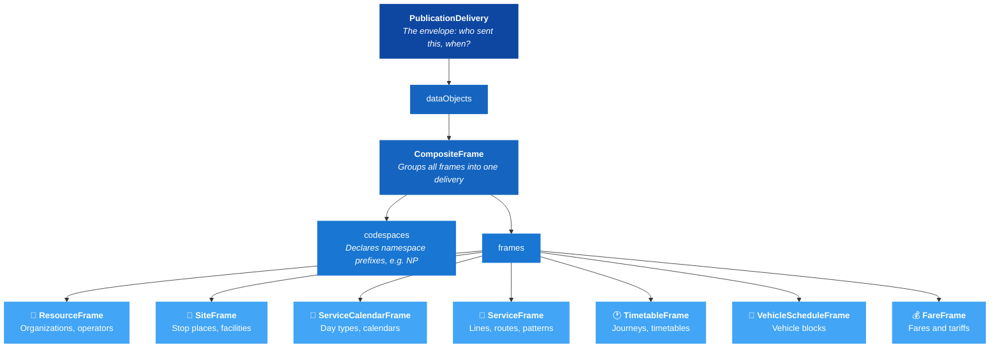

# 🚀 Get Started with NeTEx


## 1. 🎯 Introduction

This guide is for anyone working with public transport data — whether you're a developer integrating timetable feeds, a data manager at a transport authority, or an analyst exploring how NeTEx structures information.

Public transport systems across Europe need to exchange planned data — timetables, stop infrastructure, fares, vehicle schedules — between authorities, operators, and journey planners. [NeTEx](https://github.com/NeTEx-CEN/NeTEx) provides a single, standardised XML format for all of this, eliminating custom integrations and making data interoperable across borders.

By the end of this guide, you'll understand where NeTEx comes from, how it's structured, and how to read a real NeTEx document.

In this guide you will learn:
- 🌍 What Transmodel is and how NeTEx implements it
- 📄 The anatomy of a NeTEx document
- 🏗️ How frames organize data into domains
- 🔍 How to read a real example step by step

---

## 2. 🌍 The Standards Family

NeTEx is one piece of a European standards ecosystem. Understanding where it fits helps you know what NeTEx covers — and what it doesn't.

### The Big Picture

NeTEx doesn't exist in isolation — it's part of a European standards family for public transport:


> [!TIP]
> Click any box to visit its standard. When you see a NeTEx element like `ServiceJourney`, it maps directly to the Transmodel concept of a "SERVICE JOURNEY". Transmodel defines the semantics, NeTEx defines the XML.

---

## 3. 📄 Anatomy of a NeTEx Document

Once you know the outer structure, every NeTEx file becomes predictable. Here's the pattern they all follow:



### Key Concepts

**PublicationDelivery** is always the root element. It contains metadata (timestamp, participant) and wraps all data in `dataObjects`.

**CompositeFrame** groups multiple frames into a single delivery unit. Think of it as a "package" — all frames inside can reference each other.

**Frames** separate data by domain. Each frame type holds a specific kind of data. This separation means you can update timetables without touching stop data, or change fares without republishing routes.

For details, see the [CompositeFrame documentation](../../Frames/CompositeFrame/Description_CompositeFrame.md).

---

## 4. 🏗️ Frames and What They Contain

Each frame type owns a specific domain of transport data. You only include the frames your delivery needs.

| Frame | Transmodel Domain | What It Holds | Example Objects |
|-------|-------------------|---------------|-----------------|
| [ResourceFrame](../../Frames/ResourceFrame/Description_ResourceFrame.md) | Organizations | Shared resources used by all other frames | Operator, Authority, VehicleType |
| [SiteFrame](../../Frames/SiteFrame/Description_SiteFrame.md) | Fixed Objects | Physical infrastructure | StopPlace, Quay, Parking |
| [ServiceCalendarFrame](../../Frames/ServiceCalendarFrame/Description_ServiceCalendarFrame.md) | Calendar | When services operate | DayType, OperatingDay, OperatingPeriod |
| [ServiceFrame](../../Frames/ServiceFrame/Description_ServiceFrame.md) | Network | Route structure and stop assignments | Line, Route, JourneyPattern, ScheduledStopPoint |
| [TimetableFrame](../../Frames/TimetableFrame/Description_TimetableFrame.md) | Timetable | Journey scheduling | ServiceJourney, DatedServiceJourney |
| [VehicleScheduleFrame](../../Frames/VehicleScheduleFrame/Description_VehicleScheduleFrame.md) | Vehicle Planning | Vehicle assignments | Block, TrainBlock |
| [FareFrame](../../Frames/FareFrame/Description_FareFrame.md) | Fares | Pricing and products | FareZone, TariffZone |

> [!TIP]
> You don't need all frames in every delivery. A stop registry might only use SiteFrame. A timetable exchange might use ServiceCalendarFrame + ServiceFrame + TimetableFrame. Include only what's relevant.

---


## 5. 🔍 Reading Your First NeTEx File

Let's look at what a real NeTEx file looks like. At this stage, don't worry about what the objects *mean* — focus on the **structure** and the **reference pattern**.

📄 **Full file:** [Example_CompositeFrame.xml](../../Frames/CompositeFrame/Example_CompositeFrame.xml)

### The Envelope

Every NeTEx file starts the same way:

```xml
<PublicationDelivery xmlns="http://www.netex.org.uk/netex" version="2.0">
  <PublicationTimestamp>2026-03-18T00:00:00Z</PublicationTimestamp>
  <ParticipantRef>NP</ParticipantRef>
  <dataObjects>
    <CompositeFrame id="NP:CompositeFrame:1" version="1">
      <frames>
        <ResourceFrame id="NP:ResourceFrame:1" version="1">…</ResourceFrame>
        <ServiceCalendarFrame id="NP:ServiceCalendarFrame:1" version="1">…</ServiceCalendarFrame>
        <ServiceFrame id="NP:ServiceFrame:1" version="1">…</ServiceFrame>
        <TimetableFrame id="NP:TimetableFrame:1" version="1">…</TimetableFrame>
      </frames>
    </CompositeFrame>
  </dataObjects>
</PublicationDelivery>
```

That's it. `PublicationDelivery` → `CompositeFrame` → one or more frames. Every file follows this skeleton.

### The One Pattern That Matters

Inside frames, objects **reference** each other — they never duplicate data:

```xml
<!-- Defined once in ResourceFrame -->
<Operator id="NP:Operator:OP_001" version="1">
  <Name>Example Operator</Name>
</Operator>

<!-- Referenced from ServiceFrame -->
<Line id="NP:Line:L1" version="1">
  <OperatorRef ref="NP:Operator:OP_001"/>
</Line>

<!-- Referenced from TimetableFrame -->
<ServiceJourney id="NP:ServiceJourney:SJ_001" version="1">
  <LineRef ref="NP:Line:L1"/>
</ServiceJourney>
```

One object is defined once, then referenced by `id` wherever it's needed. This is how NeTEx avoids redundancy and keeps data consistent across frames.

> [!NOTE]
> All identifiers follow the pattern `Codespace:ObjectType:Identifier` — for example `NP:Operator:OP_001`. The codespace declares who owns the data. See [NeTEx Conventions](../NeTExConventions/NeTEx_Conventions.md) for the full rules.

---

## 6. 🧭 Where to Go Next

You now understand what NeTEx is and how its documents are structured. The next step is to build something.

**Continue the learning path:**

- [NeTEx Conventions](../NeTExConventions/NeTEx_Conventions.md) — ID patterns, versioning, codespace rules
- [How to Build a Timetable](../HowToBuildATimetable/HowToBuildATimetable_Guide.md) — step-by-step from stops to departures ← **start here**

**Go deeper:**

- [Calendar Guide](../Calendar/Calendar_Guide.md) — DayType, OperatingDay, date-based scheduling
- [Stop Infrastructure](../StopInfrastructure/StopInfrastructure_Guide.md) — StopPlace, Quay, and the assignment bridge
- [Tools Guide](../Tools/Tools_Guide.md) — editors, plugins, and validation setup
