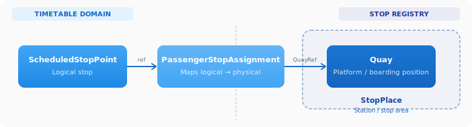
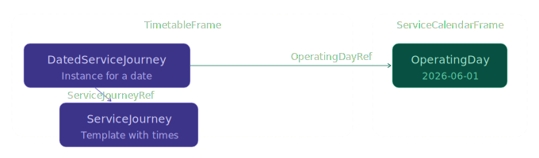

# 🕐 How to Build a Timetable

*Technical Guide*

## 1. 🎯 Introduction

You know how to plan a route: which stops a vehicle serves, in what order, and when it departs. This guide shows you how to express that knowledge in NeTEx — the European XML standard for exchanging public transport data.

We'll build a timetable step by step, starting with concepts you already know and showing the NeTEx objects that represent them. By the end, you'll have a complete picture of how stops, lines, patterns, and journeys fit together.

**In this guide you will learn:**
- 📍 How stops are represented ([ScheduledStopPoint](../../Objects/ScheduledStopPoint/Description_ScheduledStopPoint.md))
- 🚌 How a line is defined ([Line](../../Objects/Line/Description_Line.md))
- 🗺️ How the stop sequence is described ([JourneyPattern](../../Objects/JourneyPattern/Description_JourneyPattern.md))
- 🕐 How departure times are added ([ServiceJourney](../../Objects/ServiceJourney/Description_ServiceJourney.md) + TimetabledPassingTime)
- 🔗 How the pieces reference each other

> [!TIP]
> If you're new to NeTEx documents in general (frames, codespaces, the PublicationDelivery envelope), read the [Get Started guide](../GetStarted/GetStarted_Guide.md) first.


---

## 2. 🧠 The Mental Model

Think of building a timetable as answering four questions:


Each question maps to a NeTEx object:

| Question | NeTEx Object | Lives in |
|----------|-------------|----------|
| Where does it stop? | [ScheduledStopPoint](../../Objects/ScheduledStopPoint/Description_ScheduledStopPoint.md) | ServiceFrame |
| What line is it? | [Line](../../Objects/Line/Description_Line.md) | ServiceFrame |
| In what order? | [JourneyPattern](../../Objects/JourneyPattern/Description_JourneyPattern.md) | ServiceFrame |
| What time? | [ServiceJourney](../../Objects/ServiceJourney/Description_ServiceJourney.md) + TimetabledPassingTime | TimetableFrame |
| Which days? | [DatedServiceJourney](../../Objects/DatedServiceJourney/Description_DatedServiceJourney.md) + OperatingDay | TimetableFrame / ServiceCalendarFrame |

Let's build them one at a time.

---

## 3. 📍 Where does it stop? — ScheduledStopPoint

A [ScheduledStopPoint](../../Objects/ScheduledStopPoint/Description_ScheduledStopPoint.md) is a logical stopping point in the timetable. It's not the physical platform or shelter — it's the planning concept "the vehicle stops here."

```xml
<scheduledStopPoints>
    <ScheduledStopPoint id="ENT:ScheduledStopPoint:1" version="1">
        <Name>Location A</Name>
    </ScheduledStopPoint>
    <ScheduledStopPoint id="ENT:ScheduledStopPoint:2" version="1">
        <Name>Location B</Name>
    </ScheduledStopPoint>
    <ScheduledStopPoint id="ENT:ScheduledStopPoint:3" version="1">
        <Name>Location C</Name>
    </ScheduledStopPoint>
    <ScheduledStopPoint id="ENT:ScheduledStopPoint:4" version="1">
        <Name>Location D</Name>
    </ScheduledStopPoint>
</scheduledStopPoints>
```

That's it — a name and a unique ID. But every ScheduledStopPoint must be linked to a specific physical Quay (platform or boarding position) via a PassengerStopAssignment. The Quay lives inside a StopPlace in the stop registry. So while the timetable itself only references the logical point, the assignment to a Quay is mandatory — it's what tells passengers *where* to stand.




> [!IMPORTANT]
> The PassengerStopAssignment is the interface between the operator's timetable delivery and the national stop registry. The operator defines ScheduledStopPoint (logical stops used in planning), while StopPlace and Quay are maintained centrally in the stop registry. The PassengerStopAssignment bridges these two domains — it's where the operator declares "my logical stop corresponds to this physical Quay." For details on the stop registry side, see [Stop Infrastructure](../StopInfrastructure/StopInfrastructure_Guide.md).

> [!NOTE]
> The ID follows the pattern `Codespace:ObjectType:LocalId`. Here `ENT` is the codespace (who owns the data), ScheduledStopPoint is the type, and `1` is a local identifier. See [NeTEx Conventions](../NeTExConventions/NeTEx_Conventions.md) for details.

---

## 4. 🚌 What line is it? — Line

A [Line](../../Objects/Line/Description_Line.md) groups related journeys into a single public-facing service. It gives the service a name, a transport mode, and links to the operator.

```xml
<lines>
    <Line id="ENT:Line:1" version="1">
        <Name>X</Name>
        <TransportMode> rail / bus / water / tram / metro / air </TransportMode>
    </Line>
</lines>
```

Key points:
- **Name** — what passengers see in timetables and apps
- **TransportMode** — the *primary* mode of the line (`bus`, `rail`, `water`, `tram`, `metro`, etc.). Individual journeys on the line may deviate — for example a replacement bus on a rail line — but the Line declares what passengers normally expect.

> [!TIP]
> A Line can carry additional metadata like `TransportSubmode` (e.g. `expressBus`, `regionalRail`), `PublicCode` (the line number shown to passengers), `Presentation` (colours), and operator references. Start minimal and add what you need.

---

## 5. 🗺️ In what order? — JourneyPattern

A [JourneyPattern](../../Objects/JourneyPattern/Description_JourneyPattern.md) defines the ordered sequence of stops a vehicle visits. It references the ScheduledStopPoints you already defined, and puts them in sequence.

```xml
<journeyPatterns>
    <JourneyPattern id="ENT:JourneyPattern:1" version="1">
        <pointsInSequence>
            <StopPointInJourneyPattern id="ENT:StopPointInJourneyPattern:1_01" version="1" order="1">
                <ScheduledStopPointRef ref="ENT:ScheduledStopPoint:1"/>
                <ForAlighting>false</ForAlighting>
            </StopPointInJourneyPattern>
            <StopPointInJourneyPattern id="ENT:StopPointInJourneyPattern:1_02" version="1" order="2">
                <ScheduledStopPointRef ref="ENT:ScheduledStopPoint:2"/>
            </StopPointInJourneyPattern>
            <StopPointInJourneyPattern id="ENT:StopPointInJourneyPattern:1_03" version="1" order="3">
                <ScheduledStopPointRef ref="ENT:ScheduledStopPoint:3"/>
            </StopPointInJourneyPattern>
            <StopPointInJourneyPattern id="ENT:StopPointInJourneyPattern:1_04" version="1" order="4">
                <ScheduledStopPointRef ref="ENT:ScheduledStopPoint:4"/>
                <ForBoarding>false</ForBoarding>
            </StopPointInJourneyPattern>
        </pointsInSequence>
    </JourneyPattern>
</journeyPatterns>
```

Key points:
- **order** — the sequence number (1, 2, 3…). This defines the travel direction.
- **ScheduledStopPointRef** — links each position to a logical stop.
- **ForAlighting** / **ForBoarding** — controls passenger behaviour:
  - First stop: `ForAlighting=false` (you can't get off at the start)
  - Last stop: `ForBoarding=false` (you can't get on at the end)
  - Intermediate stops allow both by default

> [!NOTE]
> A JourneyPattern defines the *template*. Many ServiceJourneys can reuse the same pattern — for instance, a morning and an evening departure both following the same stop sequence.

---

## 6. 🕐 When does it depart? — ServiceJourney

Now we have stops, a line, and an order. The final piece is *time*. A [ServiceJourney](../../Objects/ServiceJourney/Description_ServiceJourney.md) ties it all together: it references a JourneyPattern and adds concrete arrival/departure times for each stop.

```xml
<vehicleJourneys>
    <ServiceJourney id="ENT:ServiceJourney:1" version="1">
        <Name>X</Name>
        <TransportMode>rail</TransportMode>
        <JourneyPatternRef ref="ENT:JourneyPattern:1" version="1"/>
        <LineRef ref="ENT:Line:1"/>
        <passingTimes>
            <TimetabledPassingTime id="ENT:TimetabledPassingTime:1_01" version="1">
                <StopPointInJourneyPatternRef ref="ENT:StopPointInJourneyPattern:1_01"/>
                <DepartureTime>08:05:00</DepartureTime>
            </TimetabledPassingTime>
            <TimetabledPassingTime id="ENT:TimetabledPassingTime:1_02" version="1">
                <StopPointInJourneyPatternRef ref="ENT:StopPointInJourneyPattern:1_02"/>
                <ArrivalTime>16:20:00</ArrivalTime>
                <DepartureTime>16:40:00</DepartureTime>
            </TimetabledPassingTime>
            <TimetabledPassingTime id="ENT:TimetabledPassingTime:1_03" version="1">
                <StopPointInJourneyPatternRef ref="ENT:StopPointInJourneyPattern:1_03"/>
                <ArrivalTime>21:30:00</ArrivalTime>
                <DepartureTime>21:45:00</DepartureTime>
            </TimetabledPassingTime>
            <TimetabledPassingTime id="ENT:TimetabledPassingTime:1_04" version="1">
                <StopPointInJourneyPatternRef ref="ENT:StopPointInJourneyPattern:1_04"/>
                <ArrivalTime>00:15:00</ArrivalTime>
                <ArrivalDayOffset>1</ArrivalDayOffset>
            </TimetabledPassingTime>
        </passingTimes>
    </ServiceJourney>
</vehicleJourneys>
```

Key points:
- **JourneyPatternRef** — tells the journey which stop sequence to follow.
- **LineRef** — connects this journey to its line.
- **TimetabledPassingTime** — one entry per stop in the pattern:
  - First stop: only `DepartureTime`
  - Intermediate stops: both `ArrivalTime` and `DepartureTime`
  - Last stop: only `ArrivalTime`
- **ArrivalDayOffset** — when a journey crosses midnight, use `1` to indicate "next day." No day offset means same day as departure.

---

## 7. 📅 Which days does it run? — DatedServiceJourney

A ServiceJourney defines *what* happens and *at what time*, but not *on which date*. To assign a journey to a specific calendar day, you create a [DatedServiceJourney](../../Objects/DatedServiceJourney/Description_DatedServiceJourney.md). It references the ServiceJourney (the template) and an OperatingDay (the date).

```xml
<ServiceCalendarFrame id="ENT:ServiceCalendarFrame:1" version="1">
    <operatingDays>
        <OperatingDay id="ENT:OperatingDay:2026-06-01" version="1">
            <CalendarDate>2026-06-01</CalendarDate>
        </OperatingDay>
        <OperatingDay id="ENT:OperatingDay:2026-06-02" version="1">
            <CalendarDate>2026-06-02</CalendarDate>
        </OperatingDay>
    </operatingDays>
</ServiceCalendarFrame>

<TimetableFrame id="ENT:TimetableFrame:1" version="1">
    <vehicleJourneys>
        <ServiceJourney id="ENT:ServiceJourney:1" version="1">
            <!-- ... as before ... -->
        </ServiceJourney>
        <DatedServiceJourney id="ENT:DatedServiceJourney:1_2026-06-01" version="1">
            <ServiceJourneyRef ref="ENT:ServiceJourney:1"/>
            <OperatingDayRef ref="ENT:OperatingDay:2026-06-01"/>
        </DatedServiceJourney>
        <DatedServiceJourney id="ENT:DatedServiceJourney:1_2026-06-02" version="1">
            <ServiceJourneyRef ref="ENT:ServiceJourney:1"/>
            <OperatingDayRef ref="ENT:OperatingDay:2026-06-02"/>
        </DatedServiceJourney>
    </vehicleJourneys>
</TimetableFrame>
```

Key points:
- **OperatingDay** — a single calendar date, defined in a ServiceCalendarFrame.
- **DatedServiceJourney** — binds a ServiceJourney to one OperatingDay. Create one per day the journey operates.
- **No times here** — the stop times come from the ServiceJourney's TimetabledPassingTime. The DatedServiceJourney only adds the *date*.



> [!NOTE]
> This is the recommended approach in the Nordic Profile. An alternative pattern using DayType and DayTypeAssignment exists for grouping multiple dates — see the [Calendar Guide](../Calendar/Calendar_Guide.md) for details.

---

## 8. 🔗 How It All Connects

Here's how the objects reference each other:



The reference chain:
1. **DatedServiceJourney** points to a **ServiceJourney** (the template) and an **OperatingDay** (the date)
2. **ServiceJourney** points to a **JourneyPattern** (the stop order) and a **Line** (the service identity)
3. **JourneyPattern** contains **StopPointInJourneyPattern** entries, each pointing to a **ScheduledStopPoint**
4. **TimetabledPassingTime** entries in the journey point back to specific **StopPointInJourneyPattern** positions

Data is defined once and referenced everywhere — no duplication.

---

## 9. 📐 Putting It Together — The Frame Structure

In the Nordic Profile, a timetable dataset is split into a **shared data file** and one or more **line files**. Shared objects — like ScheduledStopPoint, PassengerStopAssignment, and DestinationDisplay — are defined once in the shared file and reused across all line files. Line-specific objects — Line, JourneyPattern, ServiceJourney — live in each line file.



Within each file, objects live inside frames in a CompositeFrame:

```xml
<CompositeFrame id="ENT:CompositeFrame:1" version="1">
    <frames>
        <ServiceFrame id="ENT:ServiceFrame:1" version="1">
            <lines>…</lines>
            <scheduledStopPoints>…</scheduledStopPoints>
            <journeyPatterns>…</journeyPatterns>
        </ServiceFrame>

        <ServiceCalendarFrame id="ENT:ServiceCalendarFrame:1" version="1">
            <operatingDays>
                <OperatingDay>…</OperatingDay>
            </operatingDays>
        </ServiceCalendarFrame>

        <TimetableFrame id="ENT:TimetableFrame:1" version="1">
            <vehicleJourneys>
                <ServiceJourney>…</ServiceJourney>
                <DatedServiceJourney>…</DatedServiceJourney>
            </vehicleJourneys>
        </TimetableFrame>
    </frames>
</CompositeFrame>
```

The **ServiceFrame** holds the structural objects (what exists), and the **TimetableFrame** holds the temporal objects (when things happen). See the [Network Timetable Guide](../NetworkTimetable/NetworkTimetable_Guide.md) for full details on the file split.

---

## 10. ✅ Checklist — Minimum Viable Timetable

To produce a working timetable delivery, you need at minimum:

| # | Object | Count | Where |
|---|--------|-------|-------|
| 1 | ServiceJourney with TimetabledPassingTime | At least one (with planned passing times per stop) | TimetableFrame |
| 2 | JourneyPattern with StopPointInJourneyPattern | One per stop sequence variant | ServiceFrame |
| 3 | Line | At least one | ServiceFrame |
| 4 | ScheduledStopPoint | One per stop | ServiceFrame |
| 5 | PassengerStopAssignment | One per ScheduledStopPoint | ServiceFrame |
| 6 | OperatingDay | One per date in the timetable period | ServiceCalendarFrame |
| 7 | DatedServiceJourney | One per ServiceJourney per operating day | TimetableFrame |

---


## 11. 🧭 Where to Go Next

**Add passenger information:**
- [Passenger Information](../PassengerInformation/PassengerInformation_Guide.md) — [DestinationDisplay](../../Objects/DestinationDisplay/Description_DestinationDisplay.md) (headsign text), notices

**Expand the dataset:**
- [Stop Infrastructure](../StopInfrastructure/StopInfrastructure_Guide.md) — [StopPlace](../../Objects/StopPlace/Description_StopPlace.md), [Quay](../../Objects/Quay/Description_Quay.md), and how they connect via [PassengerStopAssignment](../../Objects/PassengerStopAssignment/Description_PassengerStopAssignment.md)
- [Network Timetable Guide](../NetworkTimetable/NetworkTimetable_Guide.md) — full dataset structure with shared files and line files
- [Separation of Concerns](../SeparationOfConcerns/SeparationOfConcerns.md) — how domains stay independent

**Handle special cases:**
- [Journey Lifecycle](../JourneyLifecycle/JourneyLifecycle_Guide.md) — DatedServiceJourney, cancellations, extras
- [Vehicle Scheduling](../VehicleScheduling/VehicleScheduling_Guide.md) — blocks and vehicle assignments
