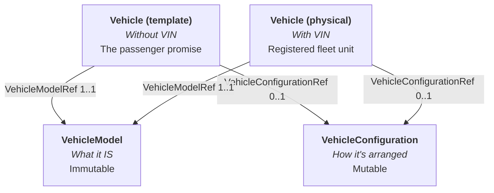
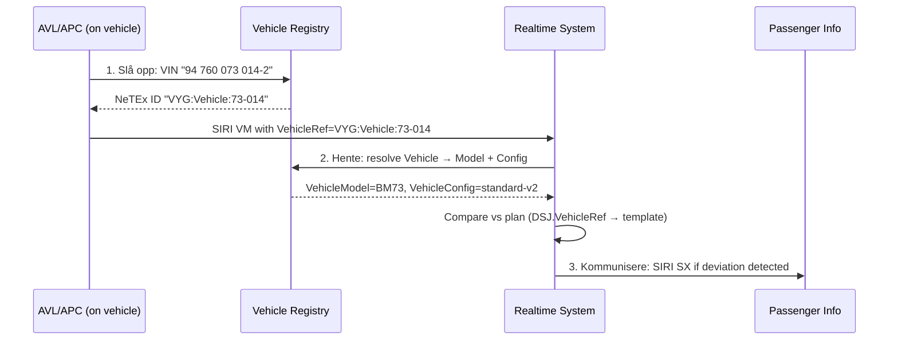

# Rolling Stock Model — v3.0

## 1. Introduction

This guide documents the redesigned rolling stock model for Nordic Profile v3.0. It replaces the VehicleType/Train/CompoundTrain hierarchy with a cleaner three-class model and introduces deviation detection as a first-class capability.

### What changed and why

The current NeTEx model conflates two concerns in `VehicleType`:
- **What a vehicle IS** (manufacturer, model, propulsion, emissions)
- **How it's configured** (seating, accessibility, facilities)

These have different lifecycles. A FLIRT 75 never becomes a Coradia (immutable), but its interior gets refurbished every few years (mutable). Splitting them enables:
- Accurate emissions reporting (model never changes)
- Configuration versioning (refurbishment = new VehicleConfiguration version)
- Reuse (many vehicles share the same configuration)

Additionally, `Vehicle` without a VIN was previously meaningless. In 3.0 it becomes the **passenger promise** — the template that says "this is what you'll get."

---

## 2. The Three Classes



### VehicleModel — What it IS (immutable)

The manufacturer's product identity. A vehicle never changes model.

| Attribute | Example |
|-----------|---------|
| Name | Stadler FLIRT 75 |
| Manufacturer | Stadler Rail |
| Length | 75 m |
| Propulsion | Electric |
| EmissionsClass | Zero |
| EnergySource | Catenary |
| AxleLoad | 17.5 t |

**Examples:** Stadler FLIRT 75, Solaris Urbino 12, MF Bastø VI, Volvo 7900 Electric.

### VehicleConfiguration — How it's arranged (mutable)

Interior arrangement and passenger-facing properties. Changes on refurbishment.

| Attribute | Example |
|-----------|---------|
| SeatingCapacity | 236 |
| StandingCapacity | 120 |
| AccessibilityProfile | wheelchair ramp, HC toilet |
| ServiceFacilitySet | WiFi, power outlets, quiet zone |
| VehicleComponents | Ordered list (coach A, B, C) |

A configuration change = new version. Many vehicles share the same configuration.

### Vehicle — The transport unit (dual role)

| VIN present? | Role | Usage |
|--------------|------|-------|
| **Yes** | Physical registered unit | In fleet registry, assigned to blocks |
| **No** | Template / profile | Referenced from ServiceJourney = "the passenger promise" |

Both reference VehicleModelRef (1..1) and VehicleConfigurationRef (0..1).

---

## 3. The Three-Layer Deviation Model

Rolling stock information flows through three layers, each with a distinct owner and semantics:

```
Layer              Mechanism                Owner                    Semantics
─────              ─────────                ─────                    ─────────
1. Plan            SJ.VehicleRef            Ruteplanlegger           Original promise
2. Planned change  DSJ version+1            Trafikkstyring           Known deviation
                   + VehicleRef
3. Actual          SIRI VM.VehicleRef       Driftssentral/AVL        Physical reality
```

### Layer 1: ServiceJourney.VehicleRef — The Original Promise

The timetable planner sets the promise: "line 60 uses FLIRT 75 comfort configuration."

```xml
<ServiceJourney id="VYG:ServiceJourney:60" version="1">
  <VehicleRef ref="VYG:Vehicle:FLIRT75-komfort"/>
  <!-- template Vehicle (no VIN) -->
</ServiceJourney>
```

The template Vehicle resolves to:
- VehicleModelRef → Stadler FLIRT 75 (emissions, energy, length)
- VehicleConfigurationRef → Komfort-config (236 seats, WiFi, quiet zone)

### Layer 2: DatedServiceJourney.VehicleRef — Known Change

When operations know the plan will deviate — but haven't assigned a specific physical unit yet — they publish a new DSJ version:

```xml
<DatedServiceJourney id="VYG:DatedServiceJourney:60-2026-04-14" version="2">
  <ServiceAlteration>planned</ServiceAlteration>
  <VehicleRef ref="VYG:Vehicle:BM73-standard"/>
  <!-- different template: BM73, fewer seats, no WiFi -->
  <ServiceJourneyRef ref="VYG:ServiceJourney:60"/>
  <OperatingDayRef ref="VYG:OperatingDay:2026-04-14"/>
</DatedServiceJourney>
```

This communicates the deviation **before** operational assignment. Downstream systems detect:
- Model changed: FLIRT 75 → BM73 (different emissions, capacity)
- Configuration changed: komfort → standard (no WiFi, fewer seats)

And trigger passenger information accordingly.

### Layer 3: SIRI VM.VehicleRef — Physical Reality

When the physical vehicle starts monitoring, the actual NeTEx Vehicle ID enters the SIRI VM stream:

```xml
<!-- SIRI VehicleMonitoring -->
<VehicleActivity>
  <MonitoredVehicleJourney>
    <VehicleRef>VYG:Vehicle:73-014</VehicleRef>
    <!-- physical Vehicle (has VIN: 94 760 073 014-2) -->
    <FramedVehicleJourneyRef>
      <DatedVehicleJourneyRef>VYG:DatedServiceJourney:60-2026-04-14</DatedVehicleJourneyRef>
    </FramedVehicleJourneyRef>
  </MonitoredVehicleJourney>
</VehicleActivity>
```

---

## 4. Deviation Detection — The Three Steps



### Step 1: Slå opp (Resolve VIN → NeTEx ID)

When vehicle monitoring starts, the on-board system (AVL/APC) knows only the physical identifier — the VIN. It calls the vehicle registry API to translate:

```
GET /vehicles?vin=94760073014-2
→ { "id": "VYG:Vehicle:73-014", "version": "3" }
```

**Access control:** This API requires authentication. VIN is sensitive fleet data — only authorised operational systems (operator's AVL backend, central realtime system) may resolve VIN to NeTEx ID. The NeTEx ID itself is non-sensitive and flows openly in SIRI.

### Step 2: Hente (Resolve Vehicle → Model + Configuration)

The consuming realtime system looks up the physical Vehicle in the registry:

```
Vehicle VYG:Vehicle:73-014
  → VehicleModelRef: NSB:VehicleModel:BM73
  → VehicleConfigurationRef: NSB:VehicleConfiguration:BM73-standard-v2
```

### Step 3: Kommunisere (Compare and Inform)

Compare the actual Vehicle's Model + Configuration against the plan:

```
Plan:   DSJ.VehicleRef → VYG:Vehicle:BM73-standard
        → Model: BM73, Config: BM73-standard-v1

Actual: VYG:Vehicle:73-014
        → Model: BM73, Config: BM73-standard-v2
```

Evaluation:
- Model matches ✓ (same BM73)
- Configuration differs: v1 → v2 (refurbishment: new seating layout)

If deviation is passenger-relevant → generate SIRI SX:

| Deviation type | Passenger impact | Action |
|----------------|-----------------|--------|
| Model differs | Capacity, emissions, accessibility | SIRI SX + booking adjustment |
| Config differs | Seating map, facilities, HC | SIRI SX + capacity update |
| Both match | None | No action |

---

## 5. Data Ownership

| Object | Owner | Registry |
|--------|-------|----------|
| VehicleModel | Central registry | Shared national |
| VehicleConfiguration | Central registry | Shared national |
| Vehicle (with VIN) | Central registry | Shared national |
| Vehicle (template) | Central registry | Shared national |
| SJ.VehicleRef | Operator (timetable delivery) | — |
| DSJ.VehicleRef | Operator (deviation delivery) | — |
| SIRI VM.VehicleRef | Operational system (AVL) | — |

### Security boundary

```
┌─────────────────────────────────┐
│  SENSITIVE (access-controlled)  │
│                                 │
│  VIN → NeTEx ID resolution      │
│  Fleet composition              │
│  Vehicle location history       │
└─────────────────────────────────┘
         │
         ▼ NeTEx Vehicle ID (abstract, non-sensitive)
┌─────────────────────────────────┐
│  OPEN (shared freely)           │
│                                 │
│  SIRI VM with VehicleRef        │
│  VehicleModel attributes        │
│  VehicleConfiguration attrs     │
│  Deviation alerts (SIRI SX)     │
└─────────────────────────────────┘
```

---

## 6. Migration from v2.x

| v2.x concept | v3.0 replacement |
|--------------|-----------------|
| VehicleType | **Deprecated** → split into VehicleModel + VehicleConfiguration |
| Vehicle.VehicleTypeRef | Vehicle.VehicleModelRef (1..1) + VehicleConfigurationRef (0..1) |
| Train | **Deprecated** → Vehicle with VehicleComponents |
| TrainComponent | VehicleComponent (child of Vehicle) |
| CompoundTrain | CompoundVehicle (coupling of Vehicles) |
| SJ.VehicleTypeRef | SJ.VehicleRef (targets template Vehicle) |
| — (no equivalent) | DSJ.VehicleRef (planned deviation override) |

### Two ResourceFrames → still valid

The v2.x pattern of separating type templates from fleet units remains valid:

```text
CompositeFrame id="REG:CompositeFrame:VehicleRegistry"
 ├── ResourceFrame id="REG:ResourceFrame:VehicleModels"
 │    └── vehicleModels/
 │         ├── VehicleModel: FLIRT75
 │         └── VehicleModel: BM73
 │
 ├── ResourceFrame id="REG:ResourceFrame:VehicleConfigurations"
 │    └── vehicleConfigurations/
 │         ├── VehicleConfiguration: FLIRT75-komfort-v3
 │         └── VehicleConfiguration: BM73-standard-v2
 │
 └── ResourceFrame id="REG:ResourceFrame:VehicleFleet"
      └── vehicles/
           ├── Vehicle: 73-014 (VIN: 94760073014-2) → Model:BM73, Config:standard-v2
           ├── Vehicle: FLIRT-001 (VIN: CHSTD...) → Model:FLIRT75, Config:komfort-v3
           └── Vehicle: FLIRT75-komfort (no VIN) → Model:FLIRT75, Config:komfort-v3 [TEMPLATE]
```

---

## 7. Separation of Concerns

The three-layer model enforces clear separation:

| Concern | Object | Who decides | When it changes |
|---------|--------|-------------|-----------------|
| Product identity | VehicleModel | Manufacturer / registry | Never (for a given vehicle) |
| Interior arrangement | VehicleConfiguration | Registry (on refurbishment) | On refit (new version) |
| Passenger promise | Vehicle template (SJ.VehicleRef) | Timetable planner | On timetable period change |
| Planned deviation | DSJ.VehicleRef | Traffic control | When deviation is known |
| Operational reality | SIRI VM.VehicleRef | AVL system | Real-time |
| Deviation detection | Compare layers 1/2 vs 3 | Realtime system | Automated |
| Passenger communication | SIRI SX | Realtime system | On deviation detected |

No single actor owns the full chain. Each layer has exactly one responsibility and one owner.
