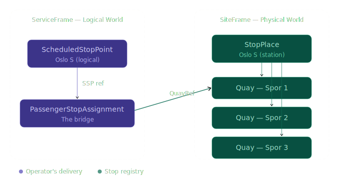
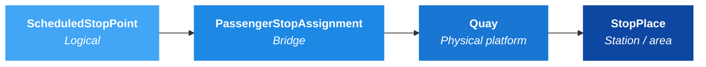
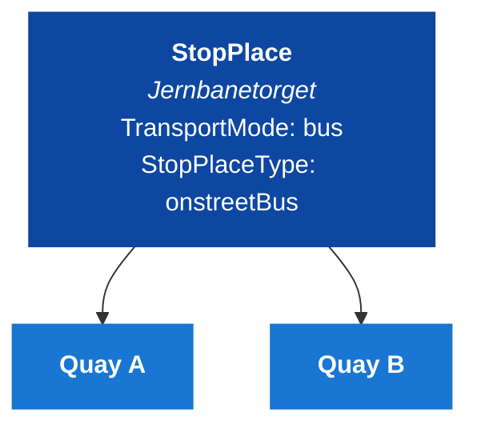
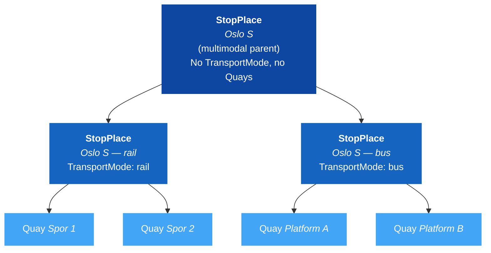
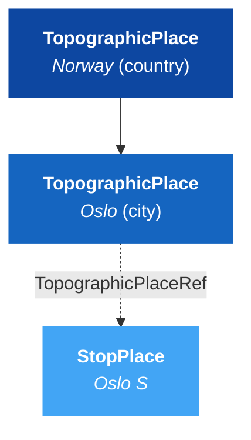
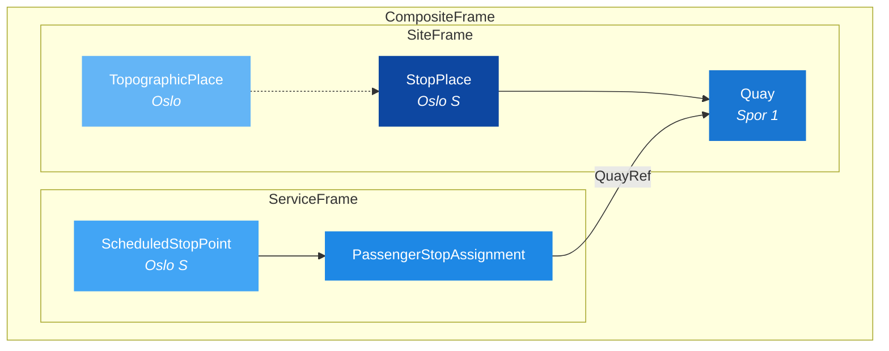

# 🚏 Stop Infrastructure — From Timetable to Platform

## 1. 🎯 Introduction

One of NeTEx's most important — and most confusing — design decisions is the separation of **logical stops** from **physical stops**. The timetable doesn't care about platform numbers or GPS coordinates; it only knows that journey X stops at point Y. The physical infrastructure — station buildings, platforms, accessibility features — lives in a completely separate layer.

The bridge between these worlds is **PassengerStopAssignment**.

In this guide you will learn:
- 🗺️ Why NeTEx splits stops into logical and physical layers
- 🔗 How PassengerStopAssignment bridges the two
- 🏗️ How StopPlace and Quay model physical infrastructure
- 🌍 How TopographicPlace and TariffZone add geographic and fare context
- 📝 A complete worked example wiring everything together

---

## 2. 🗺️ The Two Worlds of Stops



### Why the split?

| Reason | Explanation |
|--------|-------------|
| **Different owners** | Timetable planners manage ScheduledStopPoints; infrastructure teams manage StopPlaces/Quays |
| **Different lifecycles** | A platform can be renamed or relocated without changing the timetable |
| **Different granularity** | One ScheduledStopPoint might map to different Quays on different days (platform changes) |
| **Separation of concerns** | The timetable describes *what* happens; the site data describes *where* it happens |

---

## 3. 🔗 PassengerStopAssignment — The Bridge

PassengerStopAssignment connects exactly one ScheduledStopPoint to exactly one Quay:



```xml
<PassengerStopAssignment id="ERP:PassengerStopAssignment:1" version="1" order="1">
  <ScheduledStopPointRef ref="ERP:ScheduledStopPoint:OsloS"/>
  <StopPlaceRef ref="NSR:StopPlace:59977"/>   <!-- optional, can be inferred -->
  <QuayRef ref="NSR:Quay:107401"/>            <!-- the actual platform -->
</PassengerStopAssignment>
```

Key rules:
- **ScheduledStopPointRef** and **QuayRef** are both mandatory
- **StopPlaceRef** is optional — it can be inferred from the Quay's parent StopPlace
- The `@order` attribute is technically required but carries no business meaning

> [!WARNING]
> A ScheduledStopPoint without a PassengerStopAssignment cannot be resolved to a physical platform. This is the single most common data integrity problem in NeTEx datasets.

---

## 4. 🏗️ StopPlace and Quay

### Monomodal StopPlace

A simple stop serving one transport mode:



### Multimodal Hierarchy

Large transport hubs (rail + bus + metro) use a two-level hierarchy:



| Rule | Monomodal | Multimodal parent |
|------|-----------|-------------------|
| TransportMode | Required | Must NOT be present |
| Quays | At least 1 | Must have 0 |
| ParentSiteRef | Optional | Not used |

---

## 5. 🌍 Geographic and Fare Context

### TopographicPlace

Provides geographic hierarchy for stops:



### TariffZone / FareZone

Fare zones attach geographic pricing context to stops. The Nordic Profile supports both:

| Object | Where | How it links to stops |
|--------|-------|----------------------|
| `TariffZone` (legacy) | SiteFrame | Referenced *from* StopPlace via `TariffZoneRef` |
| `FareZone` (preferred) | FareFrame | Contains `members` listing `ScheduledStopPointRef`s |

> [!NOTE]
> New implementations should use `FareZone`. `TariffZone` is still supported for backward compatibility but will be phased out.

```xml
<!-- Legacy: TariffZone referenced from StopPlace -->
<StopPlace id="ERP:StopPlace:OsloS" version="1">
  <Name>Oslo S</Name>
  <tariffZones>
    <TariffZoneRef ref="ERP:TariffZone:Zone1"/>
  </tariffZones>
</StopPlace>

<!-- Preferred: FareZone with member stops -->
<FareZone id="ERP:FareZone:1" version="1">
  <Name>Zone 1</Name>
  <members>
    <ScheduledStopPointRef ref="ERP:ScheduledStopPoint:OsloS"/>
  </members>
</FareZone>
```

---

## 6. 📐 The Full Picture

All objects together in a CompositeFrame:



### Complete Example

```xml
<CompositeFrame id="ERP:CompositeFrame:stops:1" version="1">
  <frames>
    <!-- PHYSICAL: where things are -->
    <SiteFrame id="ERP:SiteFrame:1" version="1">
      <topographicPlaces>
        <TopographicPlace id="ERP:TopographicPlace:Oslo" version="1">
          <Descriptor>
            <Name>Oslo</Name>
          </Descriptor>
          <TopographicPlaceType>city</TopographicPlaceType>
          <CountryRef ref="no"/>
        </TopographicPlace>
      </topographicPlaces>
      <stopPlaces>
        <StopPlace id="ERP:StopPlace:OsloS" version="1">
          <Name>Oslo S</Name>
          <Centroid>
            <Location>
              <Longitude>10.752245</Longitude>
              <Latitude>59.910890</Latitude>
            </Location>
          </Centroid>
          <TopographicPlaceRef ref="ERP:TopographicPlace:Oslo"/>
          <TransportMode>rail</TransportMode>
          <StopPlaceType>railStation</StopPlaceType>
          <quays>
            <Quay id="ERP:Quay:OsloS_Spor1" version="1">
              <Name>Spor 1</Name>
              <Centroid>
                <Location>
                  <Longitude>10.752300</Longitude>
                  <Latitude>59.910950</Latitude>
                </Location>
              </Centroid>
              <PublicCode>1</PublicCode>
            </Quay>
          </quays>
        </StopPlace>
      </stopPlaces>
    </SiteFrame>

    <!-- LOGICAL: what the timetable knows -->
    <ServiceFrame id="ERP:ServiceFrame:1" version="1">
      <scheduledStopPoints>
        <ScheduledStopPoint id="ERP:ScheduledStopPoint:OsloS" version="1">
          <Name>Oslo S</Name>
        </ScheduledStopPoint>
      </scheduledStopPoints>
      <stopAssignments>
        <!-- THE BRIDGE: logical -> physical -->
        <PassengerStopAssignment id="ERP:PassengerStopAssignment:OsloS" version="1" order="1">
          <ScheduledStopPointRef ref="ERP:ScheduledStopPoint:OsloS"/>
          <StopPlaceRef ref="ERP:StopPlace:OsloS"/>
          <QuayRef ref="ERP:Quay:OsloS_Spor1"/>
        </PassengerStopAssignment>
      </stopAssignments>
    </ServiceFrame>
  </frames>
</CompositeFrame>
```

> [!NOTE]
> **Full example:** [Example_StopInfrastructure.xml](Example_StopInfrastructure.xml) — Complete PublicationDelivery with TopographicPlace, StopPlace, Quay, ScheduledStopPoint, and PassengerStopAssignment.

---

## 7. ✅ Best Practices

1. **Every ScheduledStopPoint needs a PassengerStopAssignment.** Without it, journey planners cannot resolve stops to physical platforms.

2. **Use the multimodal hierarchy for transport hubs.** Don't put bus and rail Quays in the same StopPlace — create a multimodal parent with monomodal children.

3. **Keep ScheduledStopPoint lightweight.** It's a logical planning concept — don't put coordinates or accessibility on it. That data belongs on StopPlace/Quay.

4. **Include TopographicPlaceRef on StopPlaces.** It enables geographic search and administrative reporting.

5. **Use precise coordinates on Quays.** At least 4 decimal places (±11m accuracy). The StopPlace Centroid should be central to all its Quays.
<!-- PROPOSAL: Consider adding gml:Polygon support for Quay (area geometry). XSD supports it via Zone inheritance. Use cases: geofencing, indoor navigation, accessibility routing. Currently only Centroid (point) is in the Nordic Profile. -->

6. **StopPlaceRef in PassengerStopAssignment is optional but recommended.** It makes the relationship explicit even though it can be inferred from the Quay's parent.

---

## 8. ❌ Common Mistakes

| Mistake | Why It Fails | Fix |
|---------|-------------|-----|
| Missing PassengerStopAssignment | Logical stop can't resolve to a platform | Always create an assignment for every ScheduledStopPoint |
| Quays on a multimodal parent | Multimodal parents must have 0 Quays | Create monomodal children with Quays instead |
| TransportMode on multimodal parent | Multimodal parents have no single mode | Remove TransportMode; set it on children |
| Coordinates on ScheduledStopPoint | It's a logical concept, not physical | Put coordinates on StopPlace/Quay instead |
| QuayRef pointing to wrong StopPlace | Data integrity violation | Verify the Quay is contained in the referenced StopPlace |
| Longitude/Latitude swapped | Geographically incorrect location | Longitude = East/West (X), Latitude = North/South (Y) |

---

## 9. 🔗 Related Resources

### Guides
- [Get Started](../GetStarted/GetStarted_Guide.md) — Introduction to NeTEx basics
- [How to Build a Timetable](../HowToBuildATimetable/HowToBuildATimetable_Guide.md) — Where ScheduledStopPoints come from
- [NeTEx Conventions](../NeTExConventions/NeTEx_Conventions.md) — ID format and naming rules

### Frames & Objects
- [SiteFrame](../../Frames/SiteFrame/Table_SiteFrame.md) — Physical infrastructure
- [ServiceFrame](../../Frames/ServiceFrame/Table_ServiceFrame.md) — Logical timetable data
- [StopPlace](../../Objects/StopPlace/Table_StopPlace.md) — Physical stop location
- [Quay](../../Objects/Quay/Table_Quay.md) — Boarding/alighting position
- [ScheduledStopPoint](../../Objects/ScheduledStopPoint/Table_ScheduledStopPoint.md) — Logical stop
- [PassengerStopAssignment](../../Objects/PassengerStopAssignment/Table_PassengerStopAssignment.md) — The bridge
- [TopographicPlace](../../Objects/TopographicPlace/Table_TopographicPlace.md) — Geographic context
- [TariffZone](../../Objects/TariffZone/Table_TariffZone.md) — Fare zone (legacy)
- [FareZone](../../Objects/FareZone/Table_FareZone.md) — Fare zone (preferred)

### External
- [NeTEx CEN Standard](https://www.netex-cen.eu/) — Official specification
