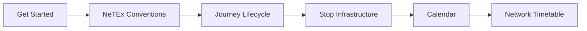

# NeTEx Nordic Profile - PROOF OF CONCEPT!

**The definitive documentation for building, validating, and understanding Nordic NeTEx data.**

Public transport in the Nordics runs on NeTEx — timetables, stops, vehicles, fares, and real-time operations all flow through this format. This repository is your single source of truth for the Nordic Profile: how it works, what it requires, and how to produce conformant data.

---

## Start here

| You want to… | Go to |
|---|---|
| Understand NeTEx from scratch | [Get Started Guide](Guides/GetStarted/GetStarted_Guide.md) |
| Learn the modelling chain (Line → Route → Journey → Departure) | [Journey Lifecycle Guide](Guides/JourneyLifecycle/JourneyLifecycle_Guide.md) |
| Look up a specific element's cardinality and rules | [Objects/](Objects/) or [Frames/](Frames/) |
| See a complete validated XML delivery | [Example_PublicationDelivery.xml](Frames/Example_PublicationDelivery.xml) |
| Validate your own XML against the profile | [scripts/validate.py](scripts/validate.py) |

---

## How this documentation works

Every NeTEx concept is documented in three layers:

```
Objects/<Name>/
  ├── Description_<Name>.md   ← What it is, when to use it, how it connects
  ├── Table_<Name>.md         ← Every element, its type, cardinality per profile
  └── Example_<Name>.xml      ← Minimal valid XML you can copy
```

**Frames** group objects into delivery containers. **Objects** are the building blocks. **Guides** explain cross-cutting patterns that span multiple objects.

The layers build bottom-up: validated XML examples are the source of truth, tables are derived from them, and descriptions are written last. This repository was built iteratively using an AI agent as co-author — constrained by XSD validation and templates, with continuous human review. For the full story, see [How This Documentation Was Built](Guides/DocumentationMethod/DocumentationMethod_Guide.md).

### Reading order for newcomers



1. **[Get Started](Guides/GetStarted/GetStarted_Guide.md)** — What NeTEx is, where it comes from, anatomy of a document
2. **[NeTEx Conventions](Guides/NeTExConventions/NeTEx_Conventions.md)** — ID patterns, versioning, naming rules
3. **[Journey Lifecycle](Guides/JourneyLifecycle/JourneyLifecycle_Guide.md)** — The core chain from Line to DatedServiceJourney
4. **[Stop Infrastructure](Guides/StopInfrastructure/StopInfrastructure_Guide.md)** — Logical stops, physical platforms, the assignment bridge
5. **[Calendar](Guides/Calendar/Calendar_Guide.md)** — DayTypes, OperatingPeriods, binding services to dates
6. **[Network Timetable](Guides/NetworkTimetable/NetworkTimetable_Guide.md)** — Producing and consuming complete datasets

### Deep dives

| Domain | Guide |
|--------|-------|
| Organisations & contracts | [Organisational Governance](Guides/OrganisationalGovernance/OrganisationalGovernance_Guide.md) |
| Vehicle assignment & blocks | [Vehicle Scheduling](Guides/VehicleScheduling/VehicleScheduling_Guide.md) |
| Rolling stock | [Rolling Stock](Guides/RollingStock/RollingStock_Guide.md) |
| Demand-responsive & booking | [Passenger Information](Guides/PassengerInformation/PassengerInformation_Guide.md) |
| Interchanges & connections | [Interchange](Guides/InterchangeOnly/Interchange_Guide.md) |
| Fares & zones | [Fare Modelling](Guides/FareModelling/FareModelling_Guide.md) |
| Deviations & replacements | [Extended Sales & Deviation](Guides/ExtendedSales_and_DeviationHandling/ExtendedSales_and_DeviationHandling_Guide.md) |
| Separation of concerns | [Separation of Concerns](Guides/SeparationOfConcerns/SeparationOfConcerns.md) |
| Central registries | [Organisation Registry](Guides/CentralOrganisationRegistry/CentralOrganisationRegistry_Guide.md) · [Vehicle Registry](Guides/CentralVehicleRegistry/CentralVehicleRegistry_Guide.md) |
| How this repo was built | [Documentation Method](Guides/DocumentationMethod/DocumentationMethod_Guide.md) |

---

## Repository structure

```
Frames/           Frame-level docs, tables, and examples (CompositeFrame, ServiceFrame, etc.)
Objects/          Object-level docs, tables, and examples (Line, Route, StopPlace, etc.)
Guides/           Topic guides — cross-cutting patterns and workflows
ontology/         TTL ontology — machine-readable profile schema and relationships
scripts/          Validation and tooling (XSD, profile rules, SHACL)
XSD/              Git submodule → NeTEx-CEN/NeTEx (full XSD schema)
LLM/              Agent guides and templates for LLM-assisted workflows
```

---

## Validate your data

```bash
# Clone with XSD submodule
git clone --recurse-submodules https://github.com/hfjelstad/NeTEx-Nordic.git
cd NeTEx-Nordic

# Set up Python
python -m venv .venv
.venv/Scripts/Activate.ps1        # Windows
# source .venv/bin/activate       # Linux/Mac
pip install lxml rdflib pyshacl

# Validate examples against full XSD
python scripts/validate.py

# Validate ontology integrity
python scripts/validate_ontology.py

# Validate SHACL shapes
python scripts/validate_shacl.py
```

---

## Design principles

- **Three layers per concept** — Description → Table → Example. Always.
- **XSD for validation** — Full `NeTEx_publication.xsd` with no shortcuts.
- **Ontology for navigation** — Machine-readable relationships, containment, and constraints.
- **Every example validates** — If it's XML in this repo, it passes the schema.

---

## Contributing

Contributions welcome — especially validated examples, corrections to element tables, and new topic guides. See the existing patterns in `Objects/` and `Guides/` for structure conventions.

## License

Documentation: CC BY 4.0  
XSD submodule: See [NeTEx-CEN/NeTEx LICENSE](https://github.com/NeTEx-CEN/NeTEx/blob/main/LICENSE)
