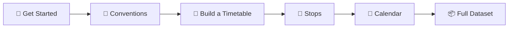

<!-- LLM agents: Read LLM/README.md for documentation conventions, templates, and navigation instructions. -->

<div align="center">

# 🚍 NeTEx Nordic Profile - NOT OFFICIAL PROFILE

**The open documentation for Nordic public transport data**

*Timetables · Stops · Vehicles · Fares · Operations*

[]()
[](https://creativecommons.org/licenses/by/4.0/)
[]()

</div>

---

> **⚠️ Proof of Concept** — This documentation is under active development. Structure, content, and conventions may change. Feedback welcome.

---

## What is this?

Public transport in the Nordics runs on **NeTEx** — every timetable, stop, vehicle assignment, and fare product flows through this XML format. But the standard is massive (900+ pages), and the Nordic Profile adds its own constraints.

This repository is a **practitioner's guide**: clear explanations, validated examples, and machine-readable rules. Whether you're building an export from a planning system or consuming data in a journey planner, start here.

---

## 🚀 Quick start



| # | Guide | You'll learn |
|---|-------|-------------|
| 1 | **[Get Started](Guides/GetStarted/GetStarted_Guide.md)** | What NeTEx is, document anatomy, frames and objects |
| 2 | **[NeTEx Conventions](Guides/NeTExConventions/NeTEx_Conventions.md)** | ID patterns, versioning, codespace rules |
| 3 | **[How to Build a Timetable](Guides/HowToBuildATimetable/HowToBuildATimetable_Guide.md)** | Line → Route → JourneyPattern → ServiceJourney → Departure |
| 4 | **[Stop Infrastructure](Guides/StopInfrastructure/StopInfrastructure_Guide.md)** | Logical stops, physical platforms, the assignment bridge |
| 5 | **[Calendar](Guides/Calendar/Calendar_Guide.md)** | DayTypes, OperatingPeriods, exceptions, date-based scheduling |
| 6 | **[Network Timetable](Guides/NetworkTimetable/NetworkTimetable_Guide.md)** | Producing and consuming complete datasets |

---

## 📖 Topic guides

Beyond the core reading path, these guides cover specific domains:

| Domain | Guide |
|--------|-------|
| 🏢 Organisations & contracts | [Organisational Governance](Guides/OrganisationalGovernance/OrganisationalGovernance_Guide.md) |
| 🚌 Vehicle assignment & blocks | [Vehicle Scheduling](Guides/VehicleScheduling/VehicleScheduling_Guide.md) |
| 🚆 Rolling stock & train composition | [Rolling Stock](Guides/RollingStock/RollingStock_Guide.md) |
| 🔄 Interchanges & connections | [Interchange](Guides/Interchange/Interchange_Guide.md) |
| 📢 Passenger information & booking | [Passenger Information](Guides/PassengerInformation/PassengerInformation_Guide.md) |
| 💰 Fares, zones & products | [Fare Modelling](Guides/FareModelling/FareModelling_Guide.md) |
| ⚠️ Deviations & replacements | [Extended Sales & Deviations](Guides/ExtendedSales_and_DeviationHandling/ExtendedSales_and_DeviationHandling_Guide.md) |
| 🏛️ Central registries | [Organisation Registry](Guides/CentralOrganisationRegistry/CentralOrganisationRegistry_Guide.md) · [Vehicle Registry](Guides/CentralVehicleRegistry/CentralVehicleRegistry_Guide.md) |
| 🛠️ Tooling & debugging | [Tools](Guides/Tools/Tools_Guide.md) |

---

## 🧱 How the documentation is structured

Every NeTEx concept follows three layers:

```
Objects/<Name>/
  ├── Description_<Name>.md   → What it is, when to use it, how it connects
  ├── Table_<Name>.md         → Every element, type, and cardinality per profile
  └── Example_<Name>.xml      → Minimal valid XML you can copy-paste
```

**[Frames/](Frames/)** group objects into delivery containers.  
**[Objects/](Objects/)** are the building blocks.  
**[Guides/](Guides/)** explain patterns that span multiple objects.  
**[ontology/](ontology/)** is the machine-readable profile schema (TTL/RDF).

> 💡 Need to look up a specific element? Browse [Objects/](Objects/) directly or check the [Glossary](Guides/Glossary/Glossary.md).

---

## ✅ Validate your data

```bash
# Clone with XSD submodule
git clone --recurse-submodules https://github.com/hfjelstad/NeTEx-Nordic.git
cd NeTEx-Nordic

# Set up Python
python -m venv .venv
.venv/Scripts/Activate.ps1        # Windows
# source .venv/bin/activate       # Linux/Mac
pip install lxml rdflib pyshacl

# Validate examples against full NeTEx XSD
python scripts/validate.py

# Validate ontology integrity
python scripts/validate_ontology.py
```

Every XML example in this repository passes full `NeTEx_publication.xsd` validation — no shortcuts, no partial schemas.

---

## 🏗️ How this was built

This documentation was built iteratively using an AI agent as co-author — constrained by XSD validation, guided by templates, and continuously reviewed by humans. The approach: start from validated XML, derive tables, write descriptions last. For the full story, see [Documentation Method](Guides/DocumentationMethod/DocumentationMethod_Guide.md).

---

## Contributing

Contributions welcome — especially validated examples, corrections to element tables, and new topic guides. See the existing patterns in `Objects/` and `Guides/` for conventions.

---

<div align="center">

**Documentation:** CC BY 4.0 · **XSD submodule:** [NeTEx-CEN/NeTEx LICENSE](https://github.com/NeTEx-CEN/NeTEx/blob/main/LICENSE)

</div>
