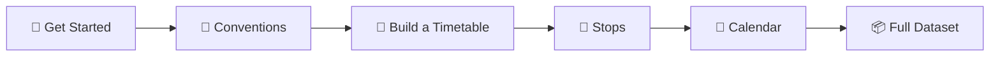

<!-- LLM agents: Read LLM/README.md for documentation conventions, templates, and navigation instructions. -->

<div align="center" style="padding: 2.5rem 1rem 1.5rem; background: linear-gradient(180deg, #f7f7fa 0%, #ffffff 100%); border-bottom: 3px solid #181C56; margin-bottom: 2rem;">

# Nordic NeTEx Profile

<p style="font-size: 1.2rem; color: #181C56; font-weight: 500; margin: 0.5rem 0;">The open documentation for Nordic public transport data</p>

<p style="font-size: 0.95rem; color: #5C5C70;">
Timetables · Stops · Vehicles · Fares · Operations
</p>

<p>
<span class="badge train">Train</span>
<span class="badge bus">Bus</span>
<span class="badge metro">Metro</span>
<span class="badge tram">Tram</span>
<span class="badge ferry">Ferry</span>
<span class="badge plane">Air</span>
</p>

[]()
[](https://creativecommons.org/licenses/by/4.0/)
[]()

</div>

> [!WARNING]
> **Proof of Concept** — This documentation is under active development. Structure, content, and conventions may change. Feedback welcome.

## What is this?

Public transport in the Nordics runs on **NeTEx** — every timetable, stop, vehicle assignment, and fare product flows through this XML format. But the standard is massive (900+ pages), and the Nordic Profile adds its own constraints.

This repository is a **practitioner's guide**: clear explanations, validated examples, and machine-readable rules. Whether you're building an export from a planning system or consuming data in a journey planner, start here.

<br>
<div style="height: 2px; background: linear-gradient(90deg, #181C56 0%, #181C56 60%, #FF5959 60%, #FF5959 100%); border-radius: 1px;"></div>
<br>

## 🚀 Quick start


```mermaid
flowchart LR
    A["🏁 Get Started"] --> B["📐 Conventions"]
    B --> C["🚌 Build a Timetable"]
    C --> D["🚏 Stops"]
    D --> E["📅 Calendar"]
    E --> F["📦 Full Dataset"]
```

| # | Guide | You'll learn |
|---|-------|-------------|
| 1 | **[Get Started](Guides/GetStarted/GetStarted_Guide.md)** | What NeTEx is, document anatomy, frames and objects |
| 2 | **[NeTEx Conventions](Guides/NeTExConventions/NeTEx_Conventions.md)** | ID patterns, versioning, codespace rules |
| 3 | **[How to Build a Timetable](Guides/HowToBuildATimetable/HowToBuildATimetable_Guide.md)** | Line → Route → JourneyPattern → ServiceJourney → Departure |
| 4 | **[Stop Infrastructure](Guides/StopInfrastructure/StopInfrastructure_Guide.md)** | Logical stops, physical platforms, the assignment bridge |
| 5 | **[Calendar](Guides/Calendar/Calendar_Guide.md)** | DayTypes, OperatingPeriods, exceptions, date-based scheduling |
| 6 | **[Network Timetable](Guides/NetworkTimetable/NetworkTimetable_Guide.md)** | Producing and consuming complete datasets |

<br>
<div style="height: 2px; background: linear-gradient(90deg, #181C56 0%, #181C56 60%, #FF5959 60%, #FF5959 100%); border-radius: 1px;"></div>
<br>

## Topic guides

Beyond the core reading path, these guides cover specific domains:

| Domain | Guide |
|--------|-------|
| <span class="badge train">Train</span> Rolling stock & composition | [Rolling Stock](Guides/RollingStock/RollingStock_Guide.md) |
| <span class="badge bus">Bus</span> Vehicle assignment & blocks | [Vehicle Scheduling](Guides/VehicleScheduling/VehicleScheduling_Guide.md) |
| <span class="badge ferry">Ferry</span> Interchanges & connections | [Interchange](Guides/Interchange/Interchange_Guide.md) |
| 🏢 Organisations & contracts | [Organisational Governance](Guides/OrganisationalGovernance/OrganisationalGovernance_Guide.md) |
| 📢 Passenger information & booking | [Passenger Information](Guides/PassengerInformation/PassengerInformation_Guide.md) |
| 💰 Fares, zones & products | [Fare Modelling](Guides/FareModelling/FareModelling_Guide.md) |
| ⚠️ Deviations & replacements | [Extended Sales & Deviations](Guides/ExtendedSales_and_DeviationHandling/ExtendedSales_and_DeviationHandling_Guide.md) |
| 🏛️ Central registries | [Organisation Registry](Guides/CentralOrganisationRegistry/CentralOrganisationRegistry_Guide.md) · [Vehicle Registry](Guides/CentralVehicleRegistry/CentralVehicleRegistry_Guide.md) |
| 🛠️ Tooling & debugging | [Tools](Guides/Tools/Tools_Guide.md) |

<br>
<div style="height: 2px; background: linear-gradient(90deg, #181C56 0%, #181C56 60%, #FF5959 60%, #FF5959 100%); border-radius: 1px;"></div>
<br>

## How the documentation is structured

Every NeTEx concept follows three layers:

<div style="background: #f7f7fa; border: 1px solid #ededf2; border-radius: 8px; padding: 1.25rem 1.5rem; font-family: 'SF Mono', 'Fira Code', monospace; font-size: 0.85rem; margin: 1rem 0;">

```
Objects/<Name>/
  ├── Description_<Name>.md   → What it is, when to use it, how it connects
  ├── Table_<Name>.md         → Every element, type, and cardinality per profile
  └── Example_<Name>.xml      → Minimal valid XML you can copy-paste
```

</div>

| Layer | Path | Contains |
|-------|------|----------|
| **Frames** | `Frames/` | Delivery containers that group objects |
| **Objects** | `Objects/` | The building blocks – one folder per concept |
| **Guides** | `Guides/` | Patterns that span multiple objects |
| **Ontology** | `ontology/` | Machine-readable profile schema (TTL/RDF) |

> [!TIP]
> Need to look up a specific element? Browse [Objects/](Objects/) directly or check the [Glossary](Guides/Glossary/Glossary.md).

<br>
<div style="height: 2px; background: linear-gradient(90deg, #181C56 0%, #181C56 60%, #FF5959 60%, #FF5959 100%); border-radius: 1px;"></div>
<br>

## Validate your data

```bash
# Clone with XSD submodule
git clone --recurse-submodules https://github.com/hfjelstad/NeTEx-Nordic.git
cd NeTEx-Nordic

# Set up Python
python -m venv .venv
.venv/Scripts/Activate.ps1        # Windows
# source .venv/bin/activate       # Linux/Mac
pip install lxml rdflib pyshacl

# Validate examples against full NeTEx XSD
python scripts/validate.py

# Validate ontology integrity
python scripts/validate_ontology.py
```

Every XML example in this repository passes full `NeTEx_publication.xsd` validation — no shortcuts, no partial schemas.

<br>
<div style="height: 2px; background: linear-gradient(90deg, #181C56 0%, #181C56 60%, #FF5959 60%, #FF5959 100%); border-radius: 1px;"></div>
<br>

## How this was built

This documentation was built iteratively using an AI agent as co-author — constrained by XSD validation, guided by templates, and continuously reviewed by humans. The approach: start from validated XML, derive tables, write descriptions last. For the full story, see [Documentation Method](Guides/DocumentationMethod/DocumentationMethod_Guide.md).

<br>
<div style="height: 2px; background: linear-gradient(90deg, #181C56 0%, #181C56 60%, #FF5959 60%, #FF5959 100%); border-radius: 1px;"></div>
<br>

## Contributing

Contributions welcome — especially validated examples, corrections to element tables, and new topic guides. See the existing patterns in `Objects/` and `Guides/` for conventions.

---

<div align="center" style="padding-top: 1rem;">

**Documentation:** CC BY 4.0 · **XSD submodule:** [NeTEx-CEN/NeTEx LICENSE](https://github.com/NeTEx-CEN/NeTEx/blob/main/LICENSE)

<p style="margin-top: 0.75rem; font-size: 0.8rem; color: #5C5C70;">Built with the Nordic NeTEx community · Powered by Entur</p>

</div>
